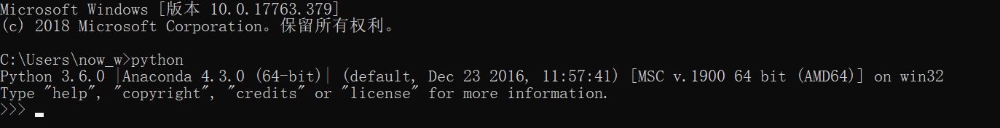
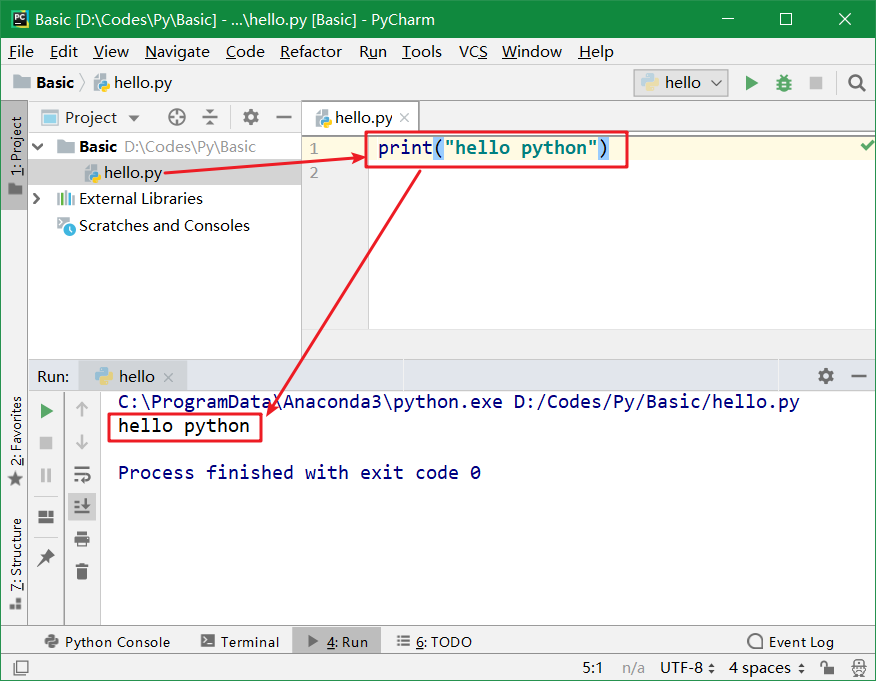

<!-- TOC -->

- [环境及配置](#环境及配置)
    - [Anaconda](#anaconda)
    - [pycharm](#pycharm)
    - [其他](#其他)
        - [PermissionError](#permissionerror)

<!-- /TOC -->

# 环境及配置

## Anaconda

Anaconda指的是一个开源的Python发行版本，其包含了conda、Python等180多个科学包及其依赖项。

可以用于在同一个机器上安装不同版本的软件包及其依赖，并能够在不同的环境之间切换。

* Anaconda Navigator ：用于管理工具包和环境的图形用户界面，后续涉及的众多管理命令也可以在 Navigator 中手工实现。
* Jupyter notebook ：基于web的交互式计算环境，可以编辑易于人们阅读的文档，用于展示数据分析的过程。
* qtconsole ：一个可执行 IPython 的仿终端图形界面程序，相比 Python Shell 界面，qtconsole 可以直接显示代码生成的图形，实现多行代码输入执行，以及内置许多有用的功能和函数。
* spyder ：一个使用Python语言、跨平台的、科学运算集成开发环境。

安装完成即已经有了python环境，如下图命令提示符中可见：

官网地址：
> https://www.anaconda.com/

历史版本-清华镜像
> https://mirrors.tuna.tsinghua.edu.cn/anaconda/archive/

## pycharm
PyCharm是一种Python IDE，带有一整套可以帮助用户在使用Python语言开发时提高其效率的工具，

比如调试、语法高亮、Project管理、代码跳转、智能提示、自动完成、单元测试、版本控制。

下载Community社区版本即可，因为Free Community

下载地址：

>https://www.jetbrains.com/pycharm/download/#section=windows

hello python

## 其他

### PermissionError
pip或者interpreter安装包时发生错误：

`PermissionError: [Errno 13] Permission denied: 'C:\\ProgramData\\Anaconda3\\pkgs\\cache\\2116b818.json'`

