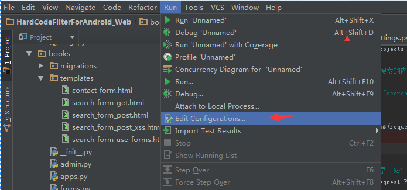
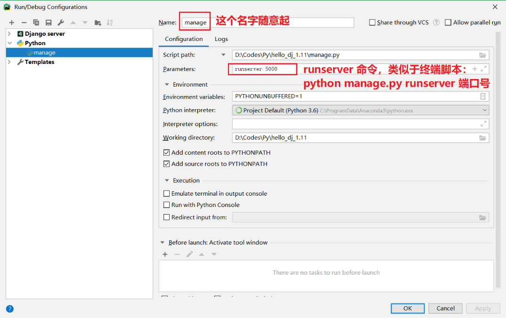

<!-- TOC -->

- [Django](#django)
    - [概要和环境](#概要和环境)
        - [第一个页面](#第一个页面)
    - [应用模块](#应用模块)
        - [应用目录结构](#应用目录结构)
        - [应用页面和url](#应用页面和url)
    - [模板Templates](#模板templates)
        - [render()](#render)
        - [TemplateDoesNotExist](#templatedoesnotexist)
        - [应用下的render()](#应用下的render)
    - [Models模块](#models模块)
        - [sqlite迁移](#sqlite迁移)
        - [数据的呈现](#数据的呈现)
        - [mysql数据库](#mysql数据库)
            - [pymysql导入安装](#pymysql导入安装)
            - [inspectdb生成model](#inspectdb生成model)
            - [mysql数据迁移](#mysql数据迁移)
            - [页面数据展现](#页面数据展现)
            - [QuerySet条件筛选](#queryset条件筛选)
            - [Q对象动态查询](#q对象动态查询)
    - [Admin](#admin)
        - [创建用户](#创建用户)
        - [配置models](#配置models)
    - [Django调试](#django调试)
    - [博客设计](#博客设计)
        - [博客主页](#博客主页)
        - [博客详情](#博客详情)
        - [链接跳转](#链接跳转)
        - [发表博客](#发表博客)
        - [修改博客](#修改博客)
        - [Templates过滤器](#templates过滤器)
        - [Admin增强](#admin增强)
    - [静态文件管理](#静态文件管理)
    - [异步数据交互](#异步数据交互)
        - [数据的获取](#数据的获取)
        - [提交数据](#提交数据)
    - [多数据连接](#多数据连接)
        - [配置多数据库](#配置多数据库)
        - [应用设置数据库](#应用设置数据库)
        - [针对数据库的inspectdb](#针对数据库的inspectdb)
    - [多表查询](#多表查询)

<!-- /TOC -->

<a id="markdown-django" name="django"></a>
# Django
Django作为一个Python的高级Web框架，功能非常强大，其自身封装了大量底层逻辑，并实现了ORM，

同时， MVT 结构保证了代码结构的完整性，这一切给了开发人员巨大的便利，让Web开发变得高效且简洁。

> https://docs.djangoproject.com/zh-hans/3.0/

<a id="markdown-概要和环境" name="概要和环境"></a>
## 概要和环境

```bash
django-admin startproject 项目名称
```

【manage.py】 与项目交互的命令行工具集入口，项目管理器

执行 python manage.py 查看所有命令

```bash
python manage.py runserver
```

【wsgi.py】 python web server gateway interface ，python服务器网关接口，很少修改

【urls.py】 URL配置，访问url需要进行配置

【settings.py】包含数据库、web应用、时间等配置

【`__init__.py`】声明模块的文件

<a id="markdown-第一个页面" name="第一个页面"></a>
### 第一个页面

在【项目名称】文件夹中添加 【views.py】 处理文件，用于处理请求并响应

```py
from django.http import HttpResponse

def index(request):
    return HttpResponse('hello django!')
```

在同目录文件 【urls.py】 中添加路由信息：

```py
from django.contrib import admin
from django.urls import path

# 引入当前目录文件
from . import views

# 第一个参数是正则匹配，第二个参数是对应的处理函数，第三个参数是名称
urlpatterns = [
    path('admin/', admin.site.urls),
    path('index/', views.index),
]
```

在 `PyCharm Terminal` 终端中输入运行命令： `python manage.py runserver 端口号`

```bash
(C:\ProgramData\Anaconda3) D:\Codes\Py\hello_dj>python manage.py runserver 5000
```

在浏览器中访问url即可： http://127.0.0.1:5000/index/  或者 http://localhost:5000/index/


<a id="markdown-应用模块" name="应用模块"></a>
## 应用模块

打开 `cmd` 命令行，进入项目中 【manage.py】 同级目录

或者直接在 `pycharm terminal` 终端窗口中操作：

输入： `python manage.py startapp 应用名称` ，应用名称不能重复

然后，添加应用名到 【settings.py】 中 `INSTALLED_APPS` 里

```py
INSTALLED_APPS = [
    'django.contrib.admin',
    'django.contrib.auth',
    'django.contrib.contenttypes',
    'django.contrib.sessions',
    'django.contrib.messages',
    'django.contrib.staticfiles',
    'blogs'#添加应用的名称
]
```

这样，新添加的应用才会起作用。

<a id="markdown-应用目录结构" name="应用目录结构"></a>
### 应用目录结构

```
migrations
    __init__.py
__init__.py
admin.py
apps.py
models.py
tests.py
views.py
```

- migrations 数据迁移模块
- admin.py 应用后台管理系统配置，Django自带后台管理系统
- apps.py 应用配置，Django-1.9后版本才有
- models.py 数据模型，使用ORM框架
- tests.py 自动化测试模块，Django提供了自动化测试
- views.py 执行响应的逻辑代码

<a id="markdown-应用页面和url" name="应用页面和url"></a>
### 应用页面和url

创建应用后，在应用文件夹下会自动生成对应的 【blog/views.py】 文件

新增处理方法 `main(request)` 

```py
from django.shortcuts import render
from django.http import HttpResponse


# Create your views here.

def main(request):
    return HttpResponse('this is blog view!')
```

添加应用中的 `urls` 配置，新增文件【blog/urls.py】，路由规则如下：

```py
from django.urls import path
from django.contrib import admin

# 引入当前目录文件
from . import views

# 用法有点类似于 Vue 的嵌套路由 访问url需要结合根url配置，localhost:5000/blog/index 
urlpatterns = [
    path('index/', views.main)
]
```

在根 `urls` 中添加配置，修改【项目名称/urls.py】文件，导入 `include` 方法

```py
from django.conf.urls import url, include
from django.contrib import admin

# 引入当前目录文件
from . import views

urlpatterns = [
    path('admin/', admin.site.urls),
    path('blog/', include('blog.urls'))
]
```

<a id="markdown-模板templates" name="模板templates"></a>
## 模板Templates
- HTML文件，DTL（Django Template Language）模板语言

<a id="markdown-render" name="render"></a>
### render()
在根路径下创建【templates】目录，用于存放前端页面文件

在【views.py】处理请求方法中通过 `render()` 返回对应的前端页面

【templates/index.html】

```html
<!DOCTYPE html>
<html lang="en">
<head>
    <meta charset="UTF-8">
    <title>hello index page</title>
</head>
<body>
<h1>hello django main page  {{ site_name }}</h1>

</body>
</html>
```

修改【项目名称/views.py】中请求处理：

```py
from django.shortcuts import render
from django.http import HttpResponse


def index(request):
    # 第一个参数是 请求上下文对象，第二个是静态文件，第三个是字典值 传参
    return render(request, 'index.html', {'site_name': '知乎'})
```

<a id="markdown-templatedoesnotexist" name="templatedoesnotexist"></a>
### TemplateDoesNotExist

如果显示 `TemplateDoesNotExist at /index/` 问题，因为 Django 3.0 创建模板没有配置默认的 `Template DIR`

修改配置【settings.py】中的 TEMPLATES 配置项：

```py
TEMPLATES = [
    {
        'BACKEND': 'django.template.backends.django.DjangoTemplates',
        'DIRS': [os.path.join(BASE_DIR, 'templates')],
        'APP_DIRS': True,
        'OPTIONS': {
            'context_processors': [
                'django.template.context_processors.debug',
                'django.template.context_processors.request',
                'django.contrib.auth.context_processors.auth',
                'django.contrib.messages.context_processors.messages',
            ],
        },
    },
]
```

<a id="markdown-应用下的render" name="应用下的render"></a>
### 应用下的render()

前面创建 `blog` 应用，也可以渲染静态页面，创建应用 `blog` 对应【templates/blog】文件夹，在该文件夹中新建HTML

【templates/blog/main.html】

```html
<!DOCTYPE html>
<html lang="en">
<head>
    <meta charset="UTF-8">
    <title>hello blog main</title>
</head>
<body>
<h1>博客主页-- {{ site_name }}</h1>

</body>
</html>
```

修改 【blog/views.py】 中请求处理方法如下：

```py
from django.shortcuts import render
from django.http import HttpResponse


# Create your views here.

def main(request):
    return render(request, 'blog/main.html', {'site_name': '博客园'})
```


<a id="markdown-models模块" name="models模块"></a>
## Models模块

<a id="markdown-sqlite迁移" name="sqlite迁移"></a>
### sqlite迁移
简单的说，先创建数据对应的模型 Models ，然后根据模型迁移生成数据库表结构

Django 中 `Models` 以 `类` 的形式出现，包含了基本字段和数据的行为。

ORM，对象关系映射 Object Relation Mapping，实现了对象和数据库的映射。

在应用 blog 文件夹内 【models.py】用于描述实体信息，继承 `models.Model` ，代码如下：

```py
from django.db import models

# Create your models here.
class Article(models.Model):
    title = models.CharField(max_length=32, default='标题')
    content = models.TextField()
```

如上，定义了一个文章类，通过命令 `python manage.py makemigrations app名（可选）`

```bash
(C:\ProgramData\Anaconda3) D:\Codes\Py\hello_dj>python manage.py makemigrations
Migrations for 'blog':
  blog\migrations\0001_initial.py
    - Create model Article

```

再执行命令 `python manage.py migrate`

```bash
(C:\ProgramData\Anaconda3) D:\Codes\Py\hello_dj>python manage.py migrate
Operations to perform:
  Apply all migrations: admin, auth, blog, contenttypes, sessions
Running migrations:
  Applying blog.0001_initial... OK

```

Django 会在 【blog/migrations】 目录下生成移植文件，如 【0001_initial.py】

执行 `python manage.py sqlmigrate 应用名称 文件id` 查看对应SQL语句

```py
(C:\ProgramData\Anaconda3) D:\Codes\Py\hello_dj>python manage.py sqlmigrate blog 0001
BEGIN;
--
-- Create model Article
--
CREATE TABLE "blog_article" ("id" integer NOT NULL PRIMARY KEY AUTOINCREMENT, "title" varchar(32) NOT NULL, "content" text NOT NULL);
COMMIT;

```

默认 sqlite3 的数据库在项目根目录下 【db.sqlite3】

可以使用 Navicat 或者 SqliteExpertPersonal 工具打开管理数据库文件。

<a id="markdown-数据的呈现" name="数据的呈现"></a>
### 数据的呈现

【blog/views.py】中 `import models`

```py
from django.shortcuts import render
from django.http import HttpResponse
from . import models


# Create your views here.

def main(request):
    # 根据主键信息查询对象，也可以根据字段 title或者content获取 
    # models.Article.objects.get(title='xxx')
    article = models.Article.objects.get(pk=1)
    return render(request, 'blog/main.html', {'article': article})
```

前端HTML页面的调整，【blog/main.html】

```html
<!DOCTYPE html>
<html lang="en">
<head>
    <meta charset="UTF-8">
    <title>hello blog main</title>
</head>
<body>
<h1>博客主页-- 知乎</h1>
<hr>

<h3>{{ article.title }}</h3>
<h3>{{ article.content }}</h3>

</body>
</html>
```

<a id="markdown-mysql数据库" name="mysql数据库"></a>
### mysql数据库

<a id="markdown-pymysql导入安装" name="pymysql导入安装"></a>
#### pymysql导入安装
高版本的 `Django` 集成 `MySql` 时可能会遇到兼容性问题：

`mysqlclient 1.3.13 or newer is required; you have 0.7.9.None.`

如果不像降 `Django` 版本的话，可以通过修改 `version_info` 的方式解决，修改项目文件夹下【`__init__.py`】

```py
import pymysql

'''
Django 3.0 和 pymysql 报以下错误，
mysqlclient 1.3.13 or newer is required; you have 0.7.9.None.
简单粗暴的解决方案，直接修改版本信息
'''
pymysql.version_info = (1, 3, 13, 'final', 0)

pymysql.install_as_MySQLdb()
```

导入 pymysql 后，确保项目可以正常执行

<a id="markdown-inspectdb生成model" name="inspectdb生成model"></a>
#### inspectdb生成model
前面案例中，我们先确定 model 模型，再使用迁移命令生成对应的数据表，和相应的数据维护。

在与 Scrapy 集成时，由于前期爬虫项目中我们已经创建好了数据库，此时我们需要使用 `inspectdb` 命令根据数据表生成 `models`

首先修改【settings.py】中数据库连接配置：

```py
# Database
# https://docs.djangoproject.com/en/3.0/ref/settings/#databases

# DATABASES = {
#     'default': {
#         'ENGINE': 'django.db.backends.sqlite3',
#         'NAME': os.path.join(BASE_DIR, 'db.sqlite3'),
#     }
# }

DATABASES = {
    'default': {
        'ENGINE': 'django.db.backends.mysql',  # 数据库引擎
        'HOST': '127.0.0.1',  # mysql服务器的域名和ip地址
        'PORT': '3306',  # mysql的一个端口号,默认是3306
        'NAME': 'db_aiit',  # 数据库名称
        'USER': 'root',  # 链接数据库的用户名
        'PASSWORD': '123456',  # 链接数据库的密码
    }
}
```

在终端窗口 `Terminal` 中执行 `python manage.py inspectdb` 检查数据表生成的 models 代码：

```bash
(D:\Anaconda3) D:\Codes\Py\aiit_web>python manage.py inspectdb
# This is an auto-generated Django model module.
# You'll have to do the following manually to clean this up:
#   * Rearrange models' order
#   * Make sure each model has one field with primary_key=True
#   * Make sure each ForeignKey and OneToOneField has `on_delete` set to the desired behavior
#   * Remove `managed = False` lines if you wish to allow Django to create, modify, and delete the table
# Feel free to rename the models, but don't rename db_table values or field names.
from django.db import models


class AiitNews(models.Model):
    title = models.CharField(max_length=100, blank=True, null=True)
    summary = models.CharField(max_length=1000, blank=True, null=True)
    author = models.CharField(max_length=50, blank=True, null=True)
    read_count = models.IntegerField(blank=True, null=True)
    pub_date = models.DateField(blank=True, null=True)

    class Meta:
        managed = False
        db_table = 'aiit_news'

```

`inspectdb` 命令会帮我们生成数据库中所有数据表对应的模型 models ，确认无误我们就可以生成 【models.py】文件

`python manage.py inspectdb 文件名称`

```bash
(D:\Anaconda3) D:\Codes\Py\aiit_web>python manage.py inspectdb > ./blogs/models.py
```

在指定目录下生成或覆盖【models.py】模型文件：

```py
# This is an auto-generated Django model module.
# You'll have to do the following manually to clean this up:
#   * Rearrange models' order
#   * Make sure each model has one field with primary_key=True
#   * Make sure each ForeignKey and OneToOneField has `on_delete` set to the desired behavior
#   * Remove `managed = False` lines if you wish to allow Django to create, modify, and delete the table
# Feel free to rename the models, but don't rename db_table values or field names.
from django.db import models


class AiitNews(models.Model):
    title = models.CharField(max_length=100, blank=True, null=True)
    summary = models.CharField(max_length=1000, blank=True, null=True)
    author = models.CharField(max_length=50, blank=True, null=True)
    read_count = models.IntegerField(blank=True, null=True)
    pub_date = models.DateField(blank=True, null=True)

    class Meta:
        managed = False
        db_table = 'aiit_news'

```

<a id="markdown-mysql数据迁移" name="mysql数据迁移"></a>
#### mysql数据迁移
我们已经从数据表生成到了 `models` 模型，为了后续的 `admin` 管理等模块，还需要进行 `migrate` 迁移

先执行 `makemigrations` 生成脚本：

```bash
(D:\Anaconda3) D:\Codes\Py\aiit_web>python manage.py makemigrations
Migrations for 'blogs':
  blogs\migrations\0001_initial.py
    - Create model AiitNews
```

`inspect` 得到的模型中 `model managed` 管理设置为 `False` ，即默认不需要由 `models` 进行表结构的维护。

当然，我们也可以将 `models.py` 中 `AiitNews` 类的内部类 `Meta managed` 属性修改为 `True` 

删除【0001_initial.py】，重新执行命令 `python manage.py makemigrations`

还可以通过生成 sql 脚本来进行具体观察：`python manage.py sqlmigrate blogs 0001`

修改【`__init__.py`】增加mysql日期类型的映射，以防创建 `admin` 模块数据表时发生异常

```py
import pymysql

'''
Django 3.0 和 pymysql 报以下错误，
mysqlclient 1.3.13 or newer is required; you have 0.7.9.None.
简单粗暴的解决方案，直接修改版本信息
'''
pymysql.version_info = (1, 3, 13, 'final', 0)

pymysql.install_as_MySQLdb()

from django.db.backends.mysql.base import DatabaseWrapper

# 因为Django2.2+ 和 MySQL5.5 的日期时间字段映射有问题，需要调整
DatabaseWrapper.data_types['DateTimeField'] = 'datetime'

```

首次数据迁移 `migrate` 时，需要使用 `--fake-initial` 参数，因为数据库已经存在，不带 `--fake` 会报错且迁移不成功。

```py
(D:\Anaconda3) D:\Codes\Py\aiit_web>python manage.py migrate --fake-initial
Operations to perform:
  Apply all migrations: admin, auth, blogs, contenttypes, sessions
Running migrations:
  Applying contenttypes.0001_initial... OK
  Applying auth.0001_initial... OK
  Applying admin.0001_initial... OK
  Applying admin.0002_logentry_remove_auto_add... OK
  Applying admin.0003_logentry_add_action_flag_choices... OK
  Applying contenttypes.0002_remove_content_type_name... OK
  Applying auth.0002_alter_permission_name_max_length... OK
  Applying auth.0003_alter_user_email_max_length... OK
  Applying auth.0004_alter_user_username_opts... OK
  Applying auth.0005_alter_user_last_login_null... OK
  Applying auth.0006_require_contenttypes_0002... OK
  Applying auth.0007_alter_validators_add_error_messages... OK
  Applying auth.0008_alter_user_username_max_length... OK
  Applying auth.0009_alter_user_last_name_max_length... OK
  Applying auth.0010_alter_group_name_max_length... OK
  Applying auth.0011_update_proxy_permissions... OK
  Applying blogs.0001_initial... OK
  Applying sessions.0001_initial... OK

                Applying auth.0006_require_contenttypes_0002... OK
  Applying auth.0007_alter_validators_add_error_messages... OK
  Applying auth.0008_alter_user_username_max_length... OK
  Applying auth.0009_alter_user_last_name_max_length... OK
  Applying auth.0010_alter_group_name_max_length... OK
  Applying auth.0011_update_proxy_permissions... OK
  Applying blogs.0001_initial... OK
  Applying sessions.0001_initial... OK

```

观察数据库中是否已新增 `auth_` 开头和 `django_` 开头的表，自动添加的这些表我们在后面会用到。

<a id="markdown-页面数据展现" name="页面数据展现"></a>
#### 页面数据展现
修改应用下视图文件【blog/views.py】

```py
from django.shortcuts import render
from . import models


# Create your views here.
def main(request):
    # models.AiitNews.objects.all() 所有新闻列表，截取前10条记录
    result = models.AiitNews.objects.all()[0:10]
    return render(request, 'blogs/blog_list.html', {'news_list': result})
```

修改对应的【blog_list.html】文件，使用模板语法循环展现对应的新闻信息：

```html
<!DOCTYPE html>
<html lang="en">
<head>
    <meta charset="UTF-8">
    <title>新闻列表</title>
</head>
<body>
<h1>
    新闻列表
</h1>

    <span>第{{ forloop.counter }}个----</span>
    {{ article_item.title }}
    <hr>

</body>
</html>
```

<a id="markdown-queryset条件筛选" name="queryset条件筛选"></a>
#### QuerySet条件筛选

字段名 | 说明
----|---
exact | 精确匹配
iexact | 不区分大小写的精确匹配
contains | 包含匹配
icontains | 不区分大小写的包含匹配
in | 在..之内的匹配
gt | 大于
gte | 大于等于
lt | 小于
lte | 小于等于
startswith | 从开头匹配
istartswith | 不区分大小写从开头匹配
endswith | 从结尾处匹配
iendswith | 不区分大小写从结尾处匹配
range | 范围匹配
date | 日期匹配
year | 年份
month | 月份
day | 日期
week | 第几周
week_day | 周几
time | 时间
hour | 小时
minute | 分钟
second | 秒
isnull | 判断是否为空
search | 1.10中被废弃
regex | 区分大小写的正则匹配
iregex | 不区分大小写的正则匹配

对新闻的标题进行模糊匹配筛选，修改应用下视图文件【blog/views.py】：

```py
from django.shortcuts import render
from . import models


# Create your views here.
def main(request):
    # 筛选 title 中包含有 '芜湖' 关键字的新闻列表
    result = models.AiitNews.objects.filter(title__contains='芜湖')
    return render(request, 'blogs/blog_list.html', {'news_list': result})
```

多条件匹配筛选，修改应用下视图文件【blog/views.py】：

```py
from django.shortcuts import render
from . import models


# Create your views here.
def main(request):
    # 筛选发布方是 '新闻中心'，并且日期大于等于 2020-6-1
    result = models.AiitNews.objects.filter(author='新闻中心', pub_date__gte='2020-6-1')
    return render(request, 'blogs/blog_list.html', {'news_list': result})
```

<a id="markdown-q对象动态查询" name="q对象动态查询"></a>
#### Q对象动态查询
在 `filter()` 中使用多个关键字参数查询，对应到数据库中是使用 AND 连接起来的。

如果你想使用更复杂的查询（例如，使用 OR 语句的查询），可以使用 Q 对象。

下例使用 Q 对象实现同样筛选的功能：

```py
from django.shortcuts import render
from . import models
from django.db.models import Q


# Create your views here.
def main(request):
    # 筛选发布方是 '新闻中心'，并且日期大于等于 2020-6-1
    result = models.AiitNews.objects.filter(Q(author='新闻中心'),Q(pub_date__gte='2020-6-1'))
    return render(request, 'blogs/blog_list.html', {'news_list': result})
```

更多时候，为了适配动态的多条件查询，我们可以这样写：

```py
from django.shortcuts import render
from . import models
from django.db.models import Q

import operator
from functools import reduce


# Create your views here.
def main(request):
    # 构造来自客户端的查询参数
    condition_summary = '疫情'
    condition_author = '教务处'
    condition_start_date = '2020-6-1'

    # 最终的查询 Q 对象
    query_condition = []

    # 判断是否有摘要信息参数
    if condition_summary:
        q_dict = {'summary__contains': condition_summary}
        query_condition.append(Q(**q_dict))

    # 判断是否有发布方参数
    if condition_author:
        q_dict = {'author__contains': condition_author}
        query_condition.append(Q(**q_dict))

    # 判断是否有发布时间参数
    if condition_start_date:
        q_dict = {'pub_date__gte': condition_start_date}
        query_condition.append(Q(**q_dict))

    # 动态条件的筛选，根据前端传递的参数决定有哪些查询参数
    result = models.AiitNews.objects.filter(reduce(operator.and_, query_condition))
    return render(request, 'blogs/blog_list.html', {'news_list': result})

```


<a id="markdown-admin" name="admin"></a>
## Admin
Admin 是 Django 自带的一个功能强大的自动化数据管理界面

被授权的用户可以直接在 Admin 中管理数据库

Django 提供了许多针对Admin的定制功能

<a id="markdown-创建用户" name="创建用户"></a>
### 创建用户
创建超级用户 `python manage.py createsuperuser` 

```bash
(C:\ProgramData\Anaconda3) D:\Codes\Py\hello_dj>python manage.py createsuperuser
Username (leave blank to use 'now_w'): admin
Email address: abc@python.com
Password:
Password (again):
Superuser created successfully.

```

密码不能太简单，不少于8个字符，推荐使用简单好记密码 `Admin@123`

管理页面入口 `localhost:端口号/admin` ，就像配置路由器一样

切换中文版显示，修改 【settings.py】文件中 `LANGUAGE_CODE='zh_Hans'`

注意，Django-2.0+版本的配置有调整： `LANGUATE_CODE='zh-hans'`

<a id="markdown-配置models" name="配置models"></a>
### 配置models

在应用下【admin.py】中引入自身的models模块，使用 `admin.site.register()` 注册模块即可

修改【blog/admin.py】文件

```py
from django.contrib import admin
from . import models

# Register your models here.
# 注册Article，使用Admin管理Article数据
admin.site.register(models.Article)
```

以上，便可以通过 Admin 模块对应用下创建的数据进行简单的增删改查。

如要切换 Admin 界面显示标题，可以修改 【blog/models.py】，增加 `def __str__(self)`

```py
from django.db import models

# Create your models here.
class Article(models.Model):
    title = models.CharField(max_length=32, default='标题')
    content = models.TextField()

    def __str__(self):
        return self.title
```

<a id="markdown-django调试" name="django调试"></a>
## Django调试

用 `PyCharm` 开发 `django` 程序的时候，对于打印日志调试程序的方式感觉还是有点麻烦和不直观，在IDE中调试方法如下：

* 打开你的工程，在菜单栏里找到Run-->Edit Configurations



* 脚本选择你网站的manage.py，脚本参数用runserver，跟平常用命令行是一样的



之后在菜单栏里找到 `Run-->Debug'debug'` ，运行后，你能在Console中看到服务器已经运行起来了，有日志打印

然后就可以通过断点开始调试了。

<a id="markdown-博客设计" name="博客设计"></a>
## 博客设计

* 博客主页页面，标题（超链接）列表，发表博客按钮
* 博客内容页面
* 编辑博客页面

<a id="markdown-博客主页" name="博客主页"></a>
### 博客主页
设计思路：

1. 取出数据库中所有文章对象
2. 将文章对象打包成列表，传递到前端
3. 前端页面显示所有文章（超链接显示标题）

修改应用 blog 处理请求代码【blog/views.py】：

```py
from django.shortcuts import render
from django.http import HttpResponse
from . import models


# Create your views here.

# 博客主页
def main(request):
    # 获取所有数据信息，返回列表
    articles = models.Article.objects.all()
    return render(request, 'blog/main.html', {'articles': articles})
```

修改对应的HTML模板页面【templates/blog/main.html】

```py
<!DOCTYPE html>
<html lang="en">
<head>
    <meta charset="UTF-8">
    <title>hello blog main</title>
</head>
<body>
<h1>
    <a href="">发表新文章</a>
</h1>


    <h3><a href="">{{ article.title }}</a></h3>


</body>
</html>
```

<a id="markdown-博客详情" name="博客详情"></a>
### 博客详情

新增一个请求处理方法，修改【blog/views.py】代码：

```py
from django.shortcuts import render
from django.http import HttpResponse
from . import models


# Create your views here.

# 博客主页
def main(request):
    articles = models.Article.objects.all()
    return render(request, 'blog/main.html', {'articles': articles})


# 博客详情界面
def article_page(request, article_id):
    article = models.Article.objects.get(pk=article_id)
    return render(request, 'blog/article_page.html', {'article': article})
```

创建对应的前端 HTML 页面，新增【templates/blog/article_page.html】：

```py
<!DOCTYPE html>
<html lang="en">
<head>
    <meta charset="UTF-8">
    <title>博客内容</title>
</head>
<body>
<h1>{{ article.title }}</h1>
<hr>
<h3>{{ article.content }}</h3>
<br><br>

<a href="">修改</a>
</body>
</html>
```

增加 url 配置，修改【blog/urls.py】文件：

```py
from django.conf.urls import url
from django.contrib import admin

# 引入当前目录文件
from . import views

# 用法有点类似于 Vue 的嵌套路由
urlpatterns = [
    path('index/', views.main),
    path('article/<int:article_id>', views.article_page),
]
```

通过正则匹配参数（此处方式比较老旧，基于 `Django-1.11` 版本，新版本使用 `Path` 方法要方便很多）

测试访问，最后 1 为传参，在请求方法 `def article_page(request, article_id):` 方法中根据 `article_id` 获取对应对象信息：

> localhost:5000/blog/article/1

<a id="markdown-链接跳转" name="链接跳转"></a>
### 链接跳转

template 中DTL可以使用 ``

`app_name` 和 `url_name` 都是在 【urls.py】中配置

`app_name` 是应用名称，在根urls中通过 `include` 配置的命名空间 `namespace`

`url_name` 是应用中urls配置的名称

配置根urls 【项目名称/urls.py】：

```py
from django.conf.urls import url, include
from django.contrib import admin

# 引入当前目录文件
from . import views

urlpatterns = [
    path('admin/', admin.site.urls),
    path('index/', views.index),
    path('blog/', include(('blog.urls', 'blog'), namespace='blog'))
]
```

增加了 `namespace` 的配置，`include` 第一个参数为元组，配置应用 `urls` 和 `app_name` 

配置应用下的urls，【blog/urls.py】：

```py
from django.conf.urls import url
from django.contrib import admin

# 引入当前目录文件
from . import views

# 用法有点类似于 Vue 的嵌套路由
urlpatterns = [
    path('index/', views.main),
    path('article/<int:article_id>', views.article_page, name='article_page'),
]
```

设置前端HTML页面，【templates/blog/main.html】

```html
<!DOCTYPE html>
<html lang="en">
<head>
    <meta charset="UTF-8">
    <title>hello blog main</title>
</head>
<body>
<h1>
    <!-- article_id=0 传值，0 表示新增的情况 -->
    <a href="">发表新文章</a>
</h1>

<hr>

    <h3>
        <a href="">{{ article.title }}</a>
    </h3>


</body>
</html>
```

<a id="markdown-发表博客" name="发表博客"></a>
### 发表博客

* 标题和内容输入
* 提交按钮
* 后端获取数据并保存数据库

新增编辑的页面，需要包含标题和内容等博客信息，创建HTML文件【templates/blog/edit_article.html】:

```py
<!DOCTYPE html>
<html lang="en">
<head>
    <meta charset="UTF-8">
    <title>发表帖子</title>
</head>
<body>
<form action="" method="post">
    
    <fieldset>
        <label for="">文章标题</label>
        <input type="text" name="title"/>
    </fieldset>
    <fieldset>
        <label for="">文章内容</label>
        <input type="text" name="content">
    </fieldset>
    <fieldset>
        <input type="submit" value="提交">
    </fieldset>
</form>
</body>
</html>
```

`form` 表单的 `action` 属性设置了对应的处理方法，对应到应用中【views.py】处理逻辑

新增应用下处理请求的方法 `def edit_article(request)` 和 `def save_article(request)`，修改【blog/views.py】：

```py
# 编辑页面
def edit_article(request):
    return render(request, 'blog/edit_article.html')


# 保存操作
def save_article(request):
    # request.POST.get('key','defaultvalue') 获取前端表单post的值，如果没有则使用默认值
    title = request.POST.get('title', '默认标题')
    content = request.POST.get('content', '默认内容')
    models.Article.objects.create(title=title, content=content)
    articles = models.Article.objects.all()
    return render(request, 'blog/main.html', {'articles': articles})
```

在应用 urls 下增加配置，修改【blog/urls.py】：

```py
urlpatterns = [
    path('index/', views.main),
    path('article/<int:article_id>', views.article_page, name='article_page'),
    path('edit', views.edit_article, name='edit_article'),
    path('save', views.save_article, name='save_article')
]
```

TODO，以上还有个bug，添加博客文章保存后刷新会重复添加数据

<a id="markdown-修改博客" name="修改博客"></a>
### 修改博客

考虑到修改页面和新增页面大部分都是重复的内容，我们需要复用页面。

修改【templates/blog/edit_article.html】：

```html
<!DOCTYPE html>
<html lang="en">
<head>
    <meta charset="UTF-8">
    <title>发表帖子</title>
</head>
<body>
<form action="" method="post">
    
    
        <h1>更新博客</h1>
    
        <h1>新增博客</h1>
    

    <input type="hidden" name="article_id" value="{{ article.id }}">
    <fieldset>
        <label for="">文章标题</label>
        <input type="text" name="title" value="{{ article.title }}"/>
    </fieldset>
    <fieldset>
        <label for="">文章内容</label>
        <input type="text" name="content" value="{{ article.content }}">
    </fieldset>
    <fieldset>
        <input type="submit" value="提交">
    </fieldset>
</form>
</body>
</html>
```

修改【blog/views.py】编辑页面方法 `def edit_article(request):`

```py
# 编辑页面
def edit_article(request, article_id):
    article = None
    # 通过列表编辑进入
    if str(article_id) != '0':
        article = models.Article.objects.get(pk=article_id)
    else:
        article = {'id': 0}
    
    return render(request, 'blog/edit_article.html', {'article': article})
```

`edit_article` 方法区分新增还是修改的业务，通过判断请求的传参进行区分

修改【blog/views.py】编辑页面方法 `def save_article(request):`

```py
# 保存操作
def save_article(request):
    # request.POST.get('key','defaultvalue') 获取前端表单post的值，如果没有则使用默认值
    title = request.POST.get('title', '默认标题')
    content = request.POST.get('content', '默认内容')
    # 新增时，默认 article_id 是没有值的
    article_id = request.POST.get('article_id', '0')

    if article_id == '':  # 新增业务
        models.Article.objects.create(title=title, content=content)
    else:  # 更新业务
        entity = models.Article.objects.get(pk=article_id)
        entity.title = title
        entity.content = content
        entity.save()

    articles = models.Article.objects.all()
    return render(request, 'blog/main.html', {'articles': articles})
```

保存方法也需要针对新增和修改进行区分

最后修改urls配置，edit入口复用新增和修改的业务，修改路由配置【blog/urls.py】：

```py
urlpatterns = [
    path('index/', views.main),
    path('article/<int:article_id>', views.article_page, name='article_page'),
    path('edit/<int:article_id>', views.edit_article, name='edit_article'),
    path('save/', views.save_article, name='save_article')
]
```

<a id="markdown-templates过滤器" name="templates过滤器"></a>
### Templates过滤器

`{{ value | filter }}`

为模版过滤器提供参数的方式是：过滤器后加个冒号，再紧跟参数，中间不能有空格！


例如为变量提供一个默认值，当 `article.id` 为空的时候 取默认值 `value`

`{{ article.id | default:'value' }}`

博客案例新增业务，当判断为新增业务时，回传前端的对象id设置可以完全在前端处理

注释掉【blog/views.py】 `edit_article` 方法中设置默认id部分

```py
# 编辑页面
def edit_article(request, article_id):
    article = None
    # 通过列表编辑进入
    if str(article_id) != '0':
        article = models.Article.objects.get(pk=article_id)
    # else:  # 新增业务时，需要标记对象id为0
    #     article = {'id': 0}
    return render(request, 'blog/edit_article.html', {'article': article})
```

并在前端页面通过 `default` 过滤器设置新增业务的默认值，修改【templates/blog/edit_article.html】

表单中隐藏域的 `value` 增加默认过滤器，当新增业务时，提交的 `article.id` 为0

```html
<input type="hidden" name="article_id" value="{{ article.id | default:0 }}">
```


更多的过滤器请参考：

> https://www.liujiangblog.com/course/django/147

<a id="markdown-admin增强" name="admin增强"></a>
### Admin增强
创建 admin配置类

class ArticleAdmin(admin.ModelAdmin)

显示其他字段， `list_display = ('title', 'content')`

`list_display` 同时支持 元组tuple和列表list，但是元素内容必须是字符串

修改应用下【blog/admin.py】

```py
from django.contrib import admin
from . import models


class ArticleAdmin(admin.ModelAdmin):
    # 设置管理界面显示字段
    list_display = ('title', 'content', 'pub_time')


# Register your models here.

# 注册Article，使用Admin管理Article数据
admin.site.register(models.Article, ArticleAdmin)
```

使用 `makemigrations` 和 `migrate` 执行数据迁移更新：

```bash
(C:\ProgramData\Anaconda3) D:\Codes\Py\hello_dj>python manage.py makemigrations
Migrations for 'blog':
  blog\migrations\0002_article_pub_time.py
    - Add field pub_time to article

(C:\ProgramData\Anaconda3) D:\Codes\Py\hello_dj>python manage.py migrate
Operations to perform:
  Apply all migrations: admin, auth, blog, contenttypes, sessions
Running migrations:
  Applying blog.0002_article_pub_time... OK

```

重新 runserver ，观察 admin 管理页面

<a id="markdown-静态文件管理" name="静态文件管理"></a>
## 静态文件管理
网站通常需要提供类似图片，JavaScript 或 CSS 的额外文件服务。

在 Django 中，我们将这些文件称为“静态文件”。

Django 提供了 `django.contrib.staticfiles` 帮你管理静态文件

通常会在根路径下的 【static】 文件夹创建 【js】、【css】、【images】等文件夹保存静态文件。

1. 确保 INSTALLED_APPS 包含了 `django.contrib.staticfiles`。

```py
INSTALLED_APPS = [
    'django.contrib.admin',
    'django.contrib.auth',
    'django.contrib.contenttypes',
    'django.contrib.sessions',
    'django.contrib.messages',
    'django.contrib.staticfiles',
    'news'
]
```

2. 在配置文件中，定义 `STATIC_URL` ，例子: `STATIC_URL = '/static/'`

```py
STATIC_URL = '/static/'
STATICFILES_DIRS = [
    os.path.join(BASE_DIR, 'static')
]
```

3. 在 `DTL` 模板中，用 `static` 模板标签基于配置 `STATICFILES_DIRS` 给定的相对路径构建 URL。

```html


```

<a id="markdown-异步数据交互" name="异步数据交互"></a>
## 异步数据交互
几个关键概念：

* 事件绑定
* ajax
* jQuery

<a id="markdown-数据的获取" name="数据的获取"></a>
### 数据的获取

首先在 【views.py】 中添加 json 数据响应：

```py
def ajax_list(request):
    # 获取前端传递的参数
    condition_title = request.POST.get('title')
    # QuerySet 必须再调用 values 方法获取值内容，否则无法进行json序列号
    result = models.AiitNews.objects.filter(title__contains=condition_title).values()
    # 转换为list列表，构造成字典，方便前端进行操作
    resp = {
        'data': list(result)
    }
    # 序列号时，关闭安全检查
    return JsonResponse(resp, safe=False)
```

添加对应的 【urls.py】 路由信息：

```py
from django.urls import path
from . import views

urlpatterns = [
    path('ajax_list/', views.ajax_list, name='ajax_list'),
]

```

前端页面中通过 ajax 请求并显示至表格中：

```html
<!DOCTYPE html>
{#全局导入一次即可#}

<html lang="en">
<head>
    <meta charset="UTF-8">
    <title>ajax获取数据</title>
    <script type="text/javascript" src=""></script>
</head>
<body>

<div class="condition">
    <fieldset>
        <legend>查询条件</legend>
        <input type="text" id="txtTitle" placeholder="输入标题查询">
        <button id="btnQuery">查询</button>
    </fieldset>
</div>
<div>
    <table id="tt" border="1">
        <thead>
        <tr>
            <th>序号</th>
            <th>标题</th>
            <th>发布方</th>
            <th>发布日期</th>
        </tr>
        </thead>
        <tbody id="tt_content"></tbody>
    </table>
</div>
<script>
    $(function () {
        $('#btnQuery').click(function () {
            $.post(""
                , {"title": $("#txtTitle").val()}
                , function (resp) {
                    $('#tt_content').empty();
                    resp.data.forEach(function (v, i) {
                        appendRow2Table(v);
                    })
                })
        })
    });

    function appendRow2Table(data_item) {
        var row_html = '<tr>';
        row_html += '<td>' + data_item.title + '</td>';
        row_html += '<td>' + data_item.title + '</td>';
        row_html += '<td>' + data_item.author + '</td>';
        row_html += '<td>' + data_item.pub_date + '</td>';
        row_html += '</tr>';

        $("#tt_content").append(row_html);
    }
</script>
</body>
</html>
```

<a id="markdown-提交数据" name="提交数据"></a>
### 提交数据
提交对象至服务端：

【views.py】 添加处理方法：

```py
def add_view(request):
    return render(request, 'news/add_view.html')


def save_ajax(request):
    print(request.POST)
    return JsonResponse({'data': None}, safe=False)
```

【urls.py】 添加路由绑定：

```py
from django.urls import path
from . import views

urlpatterns = [
    path('add/', views.add_view, name='add_view'),
    path('save_ajax/', views.save_ajax, name='save_ajax'),
]

```

前端页面进行异步提交，不会有刷新页面的体验：

```html
<!DOCTYPE html>
<html lang="en">

<head>
    <meta charset="UTF-8">
    <title>提交测试</title>
    <script type="text/javascript" src=""></script>
</head>
<body>
<h1>ajax 提交数据 </h1>
<form>
    <fieldset>
        <input type="text" id="txtTitle" placeholder="请填写标题">
        <input type="text" id="txtSummary" placeholder="请填写摘要">
        <input type="text" id="txtAuthor" placeholder="请填写发布方">
        <input type="date" id="datePub" placeholder="请填写发布日期">
        <button id="btnPublish">发布</button>
    </fieldset>
</form>
<script>
    $(function () {
        $("#btnPublish").click(function (e) {
            $.post("", {
                title: $("#txtTitle").val(),
                summary: $("#txtSummary").val(),
                author: $("#txtAuthor").val(),
                pub_date: $("#datePub").val()
            }, function (resp) {
                console.log(resp);
            });
            // 阻止表单的默认提交
            return false;
        });
    })
</script>
</body>
</html>
```

<a id="markdown-多数据连接" name="多数据连接"></a>
## 多数据连接
此处仅仅考虑如何连接多个数据，对于多数据库的同步不做讨论。


<a id="markdown-配置多数据库" name="配置多数据库"></a>
### 配置多数据库
首先需要在【settings.py】配置中增加数据库配置：

```py
DATABASES = {
    'default': {
        'ENGINE': 'django.db.backends.mysql',  # 数据库引擎
        'HOST': '127.0.0.1',  # mysql服务器的域名和ip地址
        'PORT': '3306',  # mysql的一个端口号,默认是3306
        'NAME': 'db_aiit',  # 数据库名称
        'USER': 'root',  # 链接数据库的用户名
        'PASSWORD': '123456',  # 链接数据库的密码
    },
    'db_school': {
        'ENGINE': 'django.db.backends.mysql',  # 数据库引擎
        'HOST': '127.0.0.1',  # mysql服务器的域名和ip地址
        'PORT': '3306',  # mysql的一个端口号,默认是3306
        'NAME': 'stu_db',  # 数据库名称
        'USER': 'root',  # 链接数据库的用户名
        'PASSWORD': '123456',  # 链接数据库的密码
    }
}
```

以上 `default` 名称建议保留，默认数据库的配置。

每个 `app` 都可以单独设置一个数据库，继续在【settings.py】配置文件中添加配置内容，这些内容在【database_router.py】文件使用到。

```py
'''
DATABASE_ROUTERS = ['project_name.database_router.DatabaseAppsRouter']
database_router.py 文件实现根据app设置数据库，在settings配置中添加
'''
DATABASE_ROUTERS = ['aiit_web.database_router.DatabaseAppsRouter']
# 用于配置不同应用访问的数据库
DATABASE_APPS_MAPPING = {
    # example:
    #'app_name':'database_name',
}
```

在项目同名文件夹（【settings.py】文件同级目录）下添加【database_router.py】文件：

```py
# -*- coding: utf-8 -*-
from django.conf import settings

DATABASE_MAPPING = settings.DATABASE_APPS_MAPPING


class DatabaseAppsRouter(object):
    """
    A router to control all database operations on models for different
    databases.

    In case an app is not set in settings.DATABASE_APPS_MAPPING, the router
    will fallback to the `default` database.

    Settings example:

    DATABASE_APPS_MAPPING = {'app1': 'db1', 'app2': 'db2'}
    """

    def db_for_read(self, model, **hints):
        """"Point all read operations to the specific database."""
        if model._meta.app_label in DATABASE_MAPPING:
            return DATABASE_MAPPING[model._meta.app_label]
        return None

    def db_for_write(self, model, **hints):
        """Point all write operations to the specific database."""
        if model._meta.app_label in DATABASE_MAPPING:
            return DATABASE_MAPPING[model._meta.app_label]
        return None

    def allow_relation(self, obj1, obj2, **hints):
        """Allow any relation between apps that use the same database."""
        db_obj1 = DATABASE_MAPPING.get(obj1._meta.app_label)
        db_obj2 = DATABASE_MAPPING.get(obj2._meta.app_label)
        if db_obj1 and db_obj2:
            if db_obj1 == db_obj2:
                return True
            else:
                return False
        return None

    # for Django 1.4 - Django 1.6
    def allow_syncdb(self, db, model):
        """Make sure that apps only appear in the related database."""

        if db in DATABASE_MAPPING.values():
            return DATABASE_MAPPING.get(model._meta.app_label) == db
        elif model._meta.app_label in DATABASE_MAPPING:
            return False
        return None

    # Django 1.7 - Django 1.11
    def allow_migrate(self, db, app_label, model_name=None, **hints):
        print(db, app_label, model_name, hints)
        if db in DATABASE_MAPPING.values():
            return DATABASE_MAPPING.get(app_label) == db
        elif app_label in DATABASE_MAPPING:
            return False
        return None

```

上面这段代码不用纠结，复制贴到你的项目里，确保项目可以正常运行即可。

<a id="markdown-应用设置数据库" name="应用设置数据库"></a>
### 应用设置数据库

在前面章节的配置中，默认应用会使用 `default` 数据库配置，下面创建一个新的应用，配置不同数据库的访问。

在终端中执行命令，创建应用 `school` 

```bash
python manage.py startapp school
```

在【settings.py】中对应用进行挂载，并修改 `DATABASE_APPS_MAPPING` 配置应用访问的数据库：

```py
INSTALLED_APPS = [
    'django.contrib.admin',
    'django.contrib.auth',
    'django.contrib.contenttypes',
    'django.contrib.sessions',
    'django.contrib.messages',
    'django.contrib.staticfiles',
    'news', 
    'school'
]

DATABASE_APPS_MAPPING = {
    # example:
    # 'app_name':'database_name',
    'school': 'db_school',
}
```

<a id="markdown-针对数据库的inspectdb" name="针对数据库的inspectdb"></a>
### 针对数据库的inspectdb
我们进行反向迁移inspect时，由于有多个数据库，需要通过 `--database` 指定数据库迁移

在终端中执行下面的命令检查生成的 `models` 代码：

```bash
python manage.py inspectdb --database=db_school
```

确定没有问题，生成到应用目录中：

```bash
python manage.py inspectdb --database=db_school > ./school/models.py
```

在【views.py】中添加方法测试即可：


```py
from django.shortcuts import render
from . import models


# Create your views here.
def stu_list(request):
    result = models.Student.objects.all()
    return render(request, 'school/stu_list.html', {'data': result})
```

该应用中数据的操作均针对我们配置的数据库进行的，其他路由和页面的配置省略。。。

<a id="markdown-多表查询" name="多表查询"></a>
## 多表查询
多表查询是模型层的重要功能之一, Django提供了一套基于关联字段独特的解决方案.

这里我们以非常经典的 `student、teacher、course` 为案例实现，sql脚本如下：

```sql
/*
Navicat MySQL Data Transfer

Source Server         : mysql
Source Server Version : 50515
Source Host           : localhost:3306
Source Database       : stu_db

Target Server Type    : MYSQL
Target Server Version : 50515
File Encoding         : 65001

Date: 2020-06-30 23:16:05
*/

SET FOREIGN_KEY_CHECKS=0;

-- ----------------------------
-- Table structure for `course`
-- ----------------------------
DROP TABLE IF EXISTS `course`;
CREATE TABLE `course` (
  `CNO` varchar(5) NOT NULL,
  `CNAME` varchar(10) NOT NULL,
  `TNO` varchar(10) NOT NULL,
  PRIMARY KEY (`CNO`)
) ENGINE=InnoDB DEFAULT CHARSET=utf8;

-- ----------------------------
-- Records of course
-- ----------------------------
INSERT INTO `course` VALUES ('95031', '计算机导论', '825');
INSERT INTO `course` VALUES ('95032', '操作系统', '804');
INSERT INTO `course` VALUES ('95033', '数据电路', '856');
INSERT INTO `course` VALUES ('95034', '高等数学', '100');

-- ----------------------------
-- Table structure for `student`
-- ----------------------------
DROP TABLE IF EXISTS `student`;
CREATE TABLE `student` (
  `SNO` varchar(3) NOT NULL,
  `SNAME` varchar(4) NOT NULL,
  `SSEX` varchar(2) NOT NULL,
  `SBIRTHDAY` datetime DEFAULT NULL,
  `CLASS` varchar(5) DEFAULT NULL,
  PRIMARY KEY (`SNO`)
) ENGINE=InnoDB DEFAULT CHARSET=utf8;

-- ----------------------------
-- Records of student
-- ----------------------------
INSERT INTO `student` VALUES ('101', '李军', '男', '1976-02-20 00:00:00', '95033');
INSERT INTO `student` VALUES ('103', '陆君', '男', '1977-06-03 00:00:00', '95031');
INSERT INTO `student` VALUES ('105', '匡明', '男', '1975-10-02 00:00:00', '95031');
INSERT INTO `student` VALUES ('107', '王丽', '女', '1976-01-23 00:00:00', '95033');
INSERT INTO `student` VALUES ('108', '曾华', '男', '1977-09-01 00:00:00', '95033');
INSERT INTO `student` VALUES ('109', '王芳', '女', '1977-02-10 00:00:00', '95031');

-- ----------------------------
-- Table structure for `teacher`
-- ----------------------------
DROP TABLE IF EXISTS `teacher`;
CREATE TABLE `teacher` (
  `TNO` varchar(3) NOT NULL,
  `TNAME` varchar(4) NOT NULL,
  `TSEX` varchar(2) NOT NULL,
  `TBIRTHDAY` datetime NOT NULL,
  `PROF` varchar(6) DEFAULT NULL,
  `DEPART` varchar(10) NOT NULL,
  PRIMARY KEY (`TNO`)
) ENGINE=InnoDB DEFAULT CHARSET=utf8;

-- ----------------------------
-- Records of teacher
-- ----------------------------
INSERT INTO `teacher` VALUES ('804', '李诚', '男', '1958-12-02 00:00:00', '副教授', '计算机系');
INSERT INTO `teacher` VALUES ('825', '王萍', '女', '1972-05-05 00:00:00', '助教', '计算机系');
INSERT INTO `teacher` VALUES ('831', '刘冰', '女', '1977-08-14 00:00:00', '助教', '电子工程系');
INSERT INTO `teacher` VALUES ('856', '张旭', '男', '1969-03-12 00:00:00', '讲师', '电子工程系');

```


----
参考引用：

[Django 2.0 官方中文文档](https://blog.csdn.net/weixin_42134789/article/details/80276855)

[Django 使用现有数据库生成 models](https://www.jianshu.com/p/037bd7e20a7a)

[Django从已存在的Mysql数据库表开始项目](https://blog.csdn.net/m0_37422289/article/details/82386621)

[Django Models 多条件查询 以及Q/F查询](https://my.oschina.net/esdn/blog/834943)

[Django2.0入门教程](https://www.django.cn/course/course-1.html)

[查询参数及聚合函数](https://www.liujiangblog.com/course/django/132)


