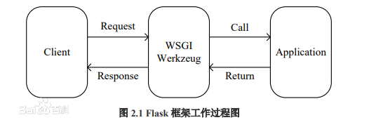
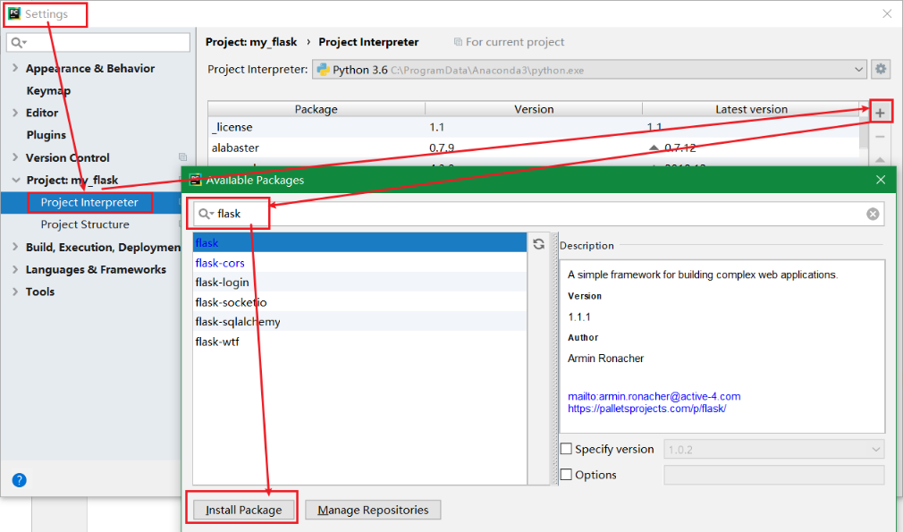

<!-- TOC -->

- [Flask](#flask)
    - [安装](#安装)
    - [模板渲染](#模板渲染)
        - [列表数据在html中展示案例](#列表数据在html中展示案例)
        - [Jinja2语法](#jinja2语法)
            - [if语句](#if语句)
            - [for循环](#for循环)
            - [set语句](#set语句)
            - [with语句](#with语句)
    - [请求和响应](#请求和响应)
        - [会话](#会话)

<!-- /TOC -->

<a id="markdown-flask" name="flask"></a>
# Flask
Flask是一个使用Python编写的轻量级 Web应用框架，基于Werkzeug WSGI工具箱和Jinja2 模板引擎。

Flask的基本模式为在程序里将一个视图函数分配给一个URL，每当用户访问这个URL时，系统就会执行给该URL分配好的视图函数，

获取函数的返回值并将其显示到浏览器上，其工作过程见图。



<a id="markdown-安装" name="安装"></a>
## 安装
File->Default Setting->Project Interpreter,搜索flask，然后左下角下载安装



```py
from flask import Flask
from flask import render_template

# __name__ 系统内置变量，生产Flask对象
app = Flask(__name__)


# 映射关系，route映射至函数
@app.route("/")
def hello():
    # 直接显示文本
    return "<h1>hello python flask</h1>"

# 判断由此脚本run启动时，才当做web服务启动
if __name__ == "__main__":
    # debug为True，自动保存发布
    app.run(host="127.0.0.1", port=5000, debug=True)
```

run输出窗口：
```
C:\ProgramData\Anaconda3\python.exe D:/Codes/Py/my_flask/run.py
 * Running on http://127.0.0.1:5000/ (Press CTRL+C to quit)
 * Restarting with stat
 * Debugger is active!
 * Debugger pin code: 141-863-845
```

可以在浏览器中访问 http://127.0.0.1:5000/ 地址。

<a id="markdown-模板渲染" name="模板渲染"></a>
## 模板渲染
使用 render_template() 方法来渲染模板

```
from flask import render_template

render_template("students.html")
```

**注意：模板一定要放到templates目录中，静态文件放到static中。**

<a id="markdown-列表数据在html中展示案例" name="列表数据在html中展示案例"></a>
### 列表数据在html中展示案例

【run.py】python启动脚本
```py
from flask import Flask
from flask import render_template

# __name__ 系统内置变量，生产Flask对象
app = Flask(__name__)


# 映射关系，route映射至函数
@app.route("/")
def hello():
    # 直接显示文本
    # return "<h1>hello python flask</h1>"
    students = [
        {"name": "tom", "age": 25, "birth": "江苏"},
        {"name": "terry", "age": 30, "birth": "安徽"},
        {"name": "jack", "age": 20, "birth": "天津"},
    ]
    # 模板加载静态html页面
    return render_template("students.html", stus=students)


# 判断由此脚本run启动时，才当做web服务启动
if __name__ == "__main__":
    # debug为True，自动保存发布
    app.run(host="127.0.0.1", port=5000, debug=True)
```

<a id="markdown-jinja2语法" name="jinja2语法"></a>
### Jinja2语法
模板语法受Django和Python的启发

* {{ ...… }}：将变量值输出到模板。
* ：声明语句，执行for，if，赋值等语句。
* {# ……#}：注释。

<a id="markdown-if语句" name="if语句"></a>
#### if语句
```py
{ % if user %}
    hello, {{ user }}

    hello, world
{% endif % }
```

<a id="markdown-for循环" name="for循环"></a>
#### for循环
```py

    <li>{{ comment }}</li>

```

列表的遍历
```py

<!--jinja语法实现 if筛选-->

<tr>
    <td>{{ one.name }}</td>
    <td>{{ one.age }}</td>
    <td>{{ one.birth }}</td>
</tr>


```

<a id="markdown-set语句" name="set语句"></a>
#### set语句
在模版中可以用set来定义变量。一旦定义了变量，以后就可以在之后使用

```py

```

<a id="markdown-with语句" name="with语句"></a>
#### with语句
定义的变量，只能在with代码块中使用，超过了就无法再使用

```py

<p>{{ classroom }}</p>

```

<a id="markdown-请求和响应" name="请求和响应"></a>
## 请求和响应
使用Flask提供的全局request对象，访问请求的数据

```py
request.method # 请求方法，如get/post
request.form[""] # 表单数据，对应form表单中name属性值
request.form.getlist("like") # 表单提交数据的列表项，比如checkbox
```

<a id="markdown-会话" name="会话"></a>
### 会话


---


参考引用：

[Flask](https://dormousehole.readthedocs.io/en/latest/)


