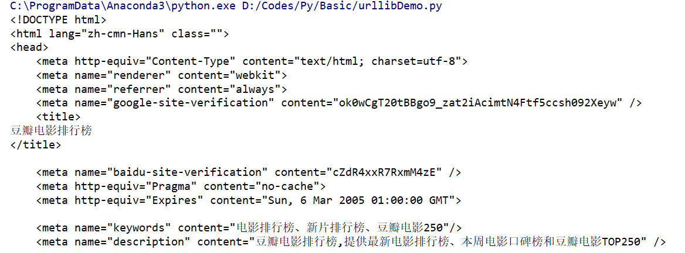
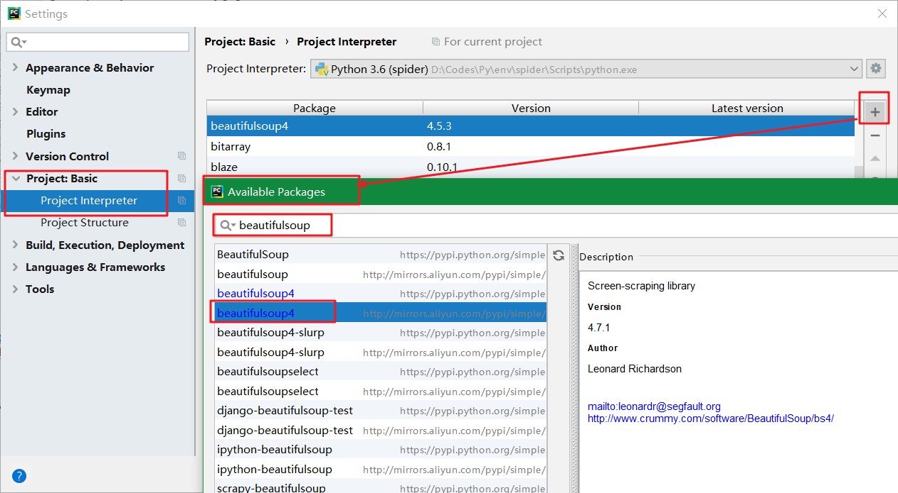

<!-- TOC -->

- [爬虫](#爬虫)
    - [爬虫过程](#爬虫过程)
    - [urllib库](#urllib库)
        - [request的使用](#request的使用)
        - [urlopen方法](#urlopen方法)
        - [Request方法](#request方法)
    - [beautifulsoap库](#beautifulsoap库)
        - [添加beautifulsoap库](#添加beautifulsoap库)
        - [快速开始](#快速开始)
        - [find_all](#find_all)
        - [find_all和find应用](#find_all和find应用)
    - [连接SQL Server入门](#连接sql-server入门)
        - [模块](#模块)
        - [连接](#连接)
        - [获取内容](#获取内容)
    - [豆瓣电影top250示例](#豆瓣电影top250示例)

<!-- /TOC -->

<a id="markdown-爬虫" name="爬虫"></a>
# 爬虫
爬虫：一段自动抓取互联网信息的程序，从互联网上抓取对于我们有价值的信息。

其实，说白了就是爬虫可以模拟浏览器的行为做你想做的事，订制化自己搜索和下载的内容，并实现自动化的操作。

比如浏览器可以下载小说，但是有时候并不能批量下载，那么爬虫的功能就有用武之地了。

Python确实很适合做爬虫，丰富的第三方库十分强大，简单几行代码便可实现你想要的功能，更重要的，Python也是数据挖掘和分析的好能手。

学习Python爬虫的大致步骤如下：

* 首先学会基本的Python语法知识
* 学习Python爬虫常用到的几个重要内置库urllib, http等，用于下载网页
* 学习正则表达式re、BeautifulSoup（bs4）、Xpath（lxml）等网页解析工具
* 开始一些简单的网站爬取（博主从百度开始的，哈哈），了解爬取数据过程
* 了解爬虫的一些反爬机制，header，robot，时间间隔，代理ip，隐含字段等
* 学习一些特殊网站的爬取，解决登录、Cookie、动态网页等问题
* 了解爬虫与数据库的结合，如何将爬取数据进行储存
* 学习应用Python的多线程、多进程进行爬取，提高爬虫效率
* 学习爬虫的框架，Scrapy、PySpider等
* 学习分布式爬虫（数据量庞大的需求）

<a id="markdown-爬虫过程" name="爬虫过程"></a>
## 爬虫过程

其实，爬虫的过程和浏览器浏览网页的过程是一样的。

道理大家应该都明白，就是当我们在键盘上输入网址点击搜索之后，通过网络首先会经过DNS服务器，分析网址的域名，找到了真正的服务器。

然后我们通过HTTP协议对服务器发出GET或POST请求，若请求成功，我们就得到了我们想看到的网页，一般都是用HTML, CSS, JS等前端技术来构建的，

若请求不成功，服务器会返回给我们请求失败的状态码，常见到的503，403等。

爬虫的过程亦是如此，通过对服务器发出请求得到HTML网页，然后对下载的网页进行解析，得到我们想要的内容。

<a id="markdown-urllib库" name="urllib库"></a>
## urllib库
Python有一个内置的urllib库，可谓是爬虫过程非常重要的一部分了。

这个内置库的使用就可以完成向服务器发出请求并获得网页的功能，所以也是学习爬虫的第一步了。

<a id="markdown-request的使用" name="request的使用"></a>
### request的使用
request请求最简单的操作是用urlopen方法，代码如下：

```python
# urllib.request 主要用于打开和阅读url
import urllib.request

# 爬取豆瓣电影排行榜
response = urllib.request.urlopen(url='https://movie.douban.com/chart')
html = response.read().decode('utf-8')
print(html)
```

运行结果为：



<a id="markdown-urlopen方法" name="urlopen方法"></a>
### urlopen方法

```python
def urlopen(url, data=None, timeout=socket._GLOBAL_DEFAULT_TI
            MEOUT,*, cafile=None, capath=None, 
            cadefault=False, context=None):
```

urlopen是request的其中一个方法，功能是打开一个URL，

URL参数可以是一串字符串（如上例子中一样），也可以是**Request对象**（后面会提到）。

* url：即是我们输入的url网址，（如：http://www.xxxx.com/）；
* data：是我们要发给服务器请求的额外信息（比如登录网页需要主动填写的用户信息）。如果需要添加data参数，那么是POST请求，默认无data参数时，就是GET请求；
    * 一般来讲，data参数只有在http协议下请求才有意义
    * data参数被规定为byte object，也就是字节对象
    * data参数应该使用标准的结构，这个需要使用urllib.parse.urlencode()将data进行 转换，而一般我们把data设置成字典格式再进行转换即可；data在以后实战中会介绍如何使用
* timeout：是选填的内容，定义超时时间，单位是秒，防止请求时间过长，不填就是默认的时间；
* cafile：是指向单独文件的，包含了一系列的CA认证 （很少使用，默认即可）;
* capath：是指向文档目标，也是用于CA认证（很少使用，默认即可）；
* cafile：可以忽略
* context：设置SSL加密传输（很少使用，默认即可）；

它会返回一个类文件对象，并可以针对这个对象进行各种操作（如上例中的read操作，将html全部读出来），其它常用方法还有：

geturl(): 返回URL，用于看是否有重定向。
info()：返回元信息，例如HTTP的headers。
getcode()：返回回复的HTTP状态码，成功是200，失败可能是503等，可以用来检查代理IP的可使用性。

<a id="markdown-request方法" name="request方法"></a>
### Request方法
```python
class Request:
    def __init__(self, url, data=None, headers={},
                 origin_req_host=None, unverifiable=False,
                 method=None):
```

如上定义，Request是一个类，初始化中包括请求需要的各种参数：

* url，data和上面urlopen中的提到的一样。
* headers是HTTP请求的报文信息，如User_Agent参数等，它可以让爬虫伪装成浏览器而不被服务器发现你正在使用爬虫。
* origin_reg_host, unverifiable, method等不太常用

headers很有用，有些网站设有反爬虫机制，检查请求若没有headers就会报错，为保证爬虫的稳定性，建议每次都会将headers信息加入进去，这是反爬的简单策略之一。

可以把这个浏览器的headers信息复制下来使用。

```python
import urllib.request

headers = {
    'accept': 'text/html,application/xhtml+xml,application/xml;q=0.9,image/webp,image/apng,*/*;q=0.8',
    'user-agent': 'Mozilla/5.0 (Windows NT 10.0; Win64; x64) AppleWebKit/537.36 (KHTML, like Gecko) Chrome/72.0.3626.81 Safari/537.36',
}

response = urllib.request.Request('https://movie.douban.com/chart', headers=headers)
html = urllib.request.urlopen(response)
result = html.read().decode('utf-8')
print(result)
```

<a id="markdown-beautifulsoap库" name="beautifulsoap库"></a>
## beautifulsoap库
Beautiful Soup 是一个可以从HTML或XML文件中提取数据的Python库.

它能够通过你喜欢的转换器实现惯用的文档导航,查找,修改文档的方式.

Beautiful Soup会帮你节省数小时甚至数天的工作时间.

<a id="markdown-添加beautifulsoap库" name="添加beautifulsoap库"></a>
### 添加beautifulsoap库

Beautiful Soup 3 目前已经停止开发，推荐在现在的项目中使用Beautiful Soup 4，不过它已经被移植到BS4了，也就是说导入时我们需要 import bs4 。

在项目设置中添加BeautifulSoup库，【File】-【Settings】，如下图所示：



<a id="markdown-快速开始" name="快速开始"></a>
### 快速开始
首先必须要导入 bs4 库
```python
#urllib.request 主要用于打开和阅读url
import urllib.request
# 导入beautifulsoup库
from bs4 import BeautifulSoup

#爬取 豆瓣电影 Top 250
response = urllib.request.urlopen('https://movie.douban.com/top250')
html = response.read()
#lxml指lxml HTML 解析器
soup = BeautifulSoup(html, 'lxml')

#打印title标签
print(soup.title)#output:<title>...</title>
```

<a id="markdown-find_all" name="find_all"></a>
### find_all
```py
#筛选所有 class为nbg的a标签
print(soup.find_all('a',{'class':'nbg'}))
```

<a id="markdown-find_all和find应用" name="find_all和find应用"></a>
### find_all和find应用
```py
# urllib.request 主要用于打开和阅读url
import urllib.request
# 导入beautifulsoup库
from bs4 import BeautifulSoup

#爬取 豆瓣电影 Top 250
response = urllib.request.urlopen('https://movie.douban.com/top250')
html = response.read()
#lxml指lxml HTML 解析器
soup = BeautifulSoup(html, 'lxml')

#筛选所有 样式为item的div标签
movieItems = soup.find_all('div', {'class': 'item'})
print(len(movieItems))  # 每页25条记录

nameList = []
ratingList = []

#遍历筛选得到的movies
for htmlDiv in movieItems:
    htmlTitle = htmlDiv.find('span', 'title')
    htmlRating = htmlDiv.find('span', 'rating_num')
    nameList.append(htmlTitle.get_text())  # 添加电影名称至列表
    ratingList.append(htmlRating.get_text())  # 添加电影评分至列表

#enumerate组合为索引序列，方便在循环时拿到索引
for i, t in enumerate(nameList):
    print(nameList[i] + '-' + ratingList[i])

'''
输出为：
25
肖申克的救赎-9.6
霸王别姬-9.6
这个杀手不太冷-9.4
阿甘正传-9.4
美丽人生-9.5
泰坦尼克号-9.3
千与千寻-9.3
辛德勒的名单-9.5
盗梦空间-9.3
忠犬八公的故事-9.3
机器人总动员-9.3
三傻大闹宝莱坞-9.2
海上钢琴师-9.2
放牛班的春天-9.3
楚门的世界-9.2
大话西游之大圣娶亲-9.2
星际穿越-9.2
龙猫-9.2
教父-9.2
熔炉-9.3
无间道-9.1
疯狂动物城-9.2
当幸福来敲门-9.0
怦然心动-9.0
触不可及-9.2
'''
```

Beautiful Soup 4.4.0 中文文档

>https://beautifulsoup.readthedocs.io/zh_CN/latest/

官方文档：

>https://www.crummy.com/software/BeautifulSoup/bs4/doc/

<a id="markdown-连接sql-server入门" name="连接sql-server入门"></a>
## 连接SQL Server入门
<a id="markdown-模块" name="模块"></a>
### 模块
```py
import pyodbc
```

pyodbc模块是用于odbc数据库（一种数据库通用接口标准）的连接，不仅限于SQL server，还包括Oracle,MySQL,Access,Excel等。

<a id="markdown-连接" name="连接"></a>
### 连接
传递odbc标准的连接字符串给 connect 方法即可：

对于SQL server写法如下：
```py
conn = pyodbc.connect(r'DRIVER={SQL Server Native Client 11.0};SERVER=192.168.1.1,3433;DATABASE=test;UID=user;PWD=password')
```
其中3433为端口号，如果默认为1433则可以省略

注意：不同的SQL server版本对应的DRIVER字段不同。对应关系如下：
* {SQL Server} - released with SQL Server 2000
* {SQL Native Client} - released with SQL Server 2005 (also known as version 9.0)
* {SQL Server Native Client 10.0} - released with SQL Server 2008
* {SQL Server Native Client 11.0} - released with SQL Server 2012

<a id="markdown-获取内容" name="获取内容"></a>
### 获取内容
获取单行内容：
```py
import pyodbc

conn = pyodbc.connect(r'DRIVER={SQL Server Native Client 11.0};SERVER=.;DATABASE=db_movie;UID=sa;PWD=123456')

#连接之后需要先建立cursor游标：
cursor = conn.cursor()

#使用 execute 方法运行SQL语句：
cursor.execute('select id, name from t_user')

#fetchone()方法 获取一行记录
row = cursor.fetchone()
if row:
    print(row)
    print('name-' + row[1])

row = cursor.fetchone()
if row:
    print(row)
    print('name-' + row.name)
```

一次获取所有记录：
```py
import pyodbc

conn = pyodbc.connect(r'DRIVER={SQL Server Native Client 11.0};SERVER=.;DATABASE=db_movie;UID=sa;PWD=123456')

# 连接之后需要先建立cursor游标：
cursor = conn.cursor()

# 使用fetchall()直接获取所有execute结果作为一个list：
cursor.execute('select id, name from t_user')
userList = cursor.fetchall()
print('遍历所有结果：')
for user in userList:
    print(user)
```

<a id="markdown-豆瓣电影top250示例" name="豆瓣电影top250示例"></a>
## 豆瓣电影top250示例
```py
import urllib.request
from bs4 import BeautifulSoup
import pyodbc

# 数据库连接配置
conn = pyodbc.connect(r'DRIVER={SQL Server Native Client 11.0};SERVER=.;DATABASE=db_movie;UID=sa;PWD=123456')
# 连接之后需要先建立cursor：
cursor = conn.cursor()


# 插入写库操作
def insert(name_list, rating_list):
    if len(name_list) != len(rating_list):
        return False
    for ind, ite in enumerate(name_list):
        # print("insert into t_movie (name,rating) values ('{name}','{rating}')".format(name=name_list[ind], rating=rating_list[ind]))
        cursor.execute('insert into t_movie (name,rating) values (?,?)', name_list[ind], rating_list[ind])

    cursor.commit()


# 按照url匹配
def find_movies(url):
    _name_list = []
    _rating_list = []
    response = urllib.request.urlopen('https://movie.douban.com/top250')
    html = response.read()
    # lxml指lxml HTML 解析器
    soup = BeautifulSoup(html, 'lxml')
    # 筛选所有 样式为item的div标签
    movieItems = soup.find_all('div', {'class': 'item'})
    # 遍历筛选得到的movies
    for htmlDiv in movieItems:
        html_title = htmlDiv.find('span', 'title')
        html_rating = htmlDiv.find('span', 'rating_num')
        _name_list.append(html_title.get_text())  # 添加电影名称至列表
        _rating_list.append(html_rating.get_text())  # 添加电影评分至列表
    insert(_name_list, _rating_list)
    return


# 主执行程序
# top25，最后一页从225开始
max = 225
# 每页25条记录
step = 25
# 当前起始记录
current = 0
url = 'https://movie.douban.com/top250?start='
while current < 250:
    find_movies(url + str(current))
    current += step
print('已完成top250电影导入')

cursor.execute('select * from t_movie')
for mov in cursor:
    print(mov)

cursor.close()
```


---

参考引用：

[Python爬虫学习](https://segmentfault.com/a/1190000012681700)

[Python 3 教程](http://www.runoob.com/python3/python3-tutorial.html)

[Python连接SQL Server入门](https://blog.csdn.net/chroming/article/details/51541959)

[Python使用pyodbc访问数据库操作方法详解](https://www.jb51.net/article/143212.htm)