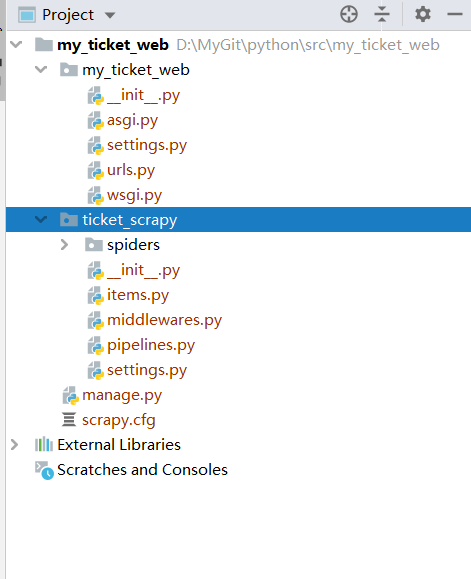

<!-- TOC -->

- [爬虫案例](#爬虫案例)
    - [项目创建](#项目创建)
    - [余票信息数据获取](#余票信息数据获取)
        - [创建spider](#创建spider)
        - [Request请求](#request请求)
        - [添加cookie](#添加cookie)
        - [新增启动文件start](#新增启动文件start)
        - [cookie帮助方法](#cookie帮助方法)
    - [车站信息解析](#车站信息解析)
        - [添加车站爬虫](#添加车站爬虫)
        - [车站模型分析](#车站模型分析)
        - [车站对象构造](#车站对象构造)
        - [数据表设计](#数据表设计)
        - [管道数据处理](#管道数据处理)
        - [爬取车站测试](#爬取车站测试)
    - [余票信息解析](#余票信息解析)
        - [余票查询json格式分析](#余票查询json格式分析)
        - [余票Item类](#余票item类)
        - [余票数据表](#余票数据表)
        - [构造余票对象](#构造余票对象)
        - [余票持久化](#余票持久化)
        - [带参数的spider](#带参数的spider)
    - [数据展现](#数据展现)
        - [创建应用](#创建应用)
        - [inspectdb反向迁移](#inspectdb反向迁移)
        - [当前余票展现](#当前余票展现)
    - [数据可视化](#数据可视化)
        - [数据准备](#数据准备)
        - [禁用](#禁用)
        - [数据处理](#数据处理)
        - [折线图显示](#折线图显示)

<!-- /TOC -->

<a id="markdown-爬虫案例" name="爬虫案例"></a>
# 爬虫案例
基于 `Scrapy` 和 `Django` 的爬虫应用，爬取数据并持久化保存至 `mysql` ，可视化方式展现。

<a id="markdown-项目创建" name="项目创建"></a>
## 项目创建

在命令提示符中分别执行以下两个命令，创建django项目和scrapy项目

`django-admin startproject my_ticket_web`

`scrapy startproject ticket_scrapy`

拷贝scrapy项目生成的【ticket_scrapy】和【scrapy.cfg】移动至django项目根目录中，如下图所示：



通过命令创建的项目，在 `pycharm` 中不要忘记配置对应的解释器 `project interpreter` 

<a id="markdown-余票信息数据获取" name="余票信息数据获取"></a>
## 余票信息数据获取

<a id="markdown-创建spider" name="创建spider"></a>
### 创建spider

在终端窗口中执行下面的命令创建爬取余票信息的 `spider` 

```bash
scrapy genspider ticket_spider www.12306.cn
```

后面的域名可以缺省，在代码文件中直接设置也是相同作用。

<a id="markdown-request请求" name="request请求"></a>
### Request请求

当我们实际查询A地到B地的时候，浏览器的url会发生跳转至： 

```
https://kyfw.12306.cn/otn/leftTicket/init?linktypeid=dc&fs=%E5%90%88%E8%82%A5,HFH&ts=%E8%8A%9C%E6%B9%96,WHH&date=2020-06-30&flag=N,N,Y
```

在新的查询页面进行查询操作，触发请求操作，浏览器【network】跟踪得知，实际 `ajax` 请求接口为：

```
Request URL: https://kyfw.12306.cn/otn/leftTicket/query?leftTicketDTO.train_date=2020-06-30&leftTicketDTO.from_station=HFH&leftTicketDTO.to_station=WHH&purpose_codes=ADULT
Request Method: GET
Status Code: 200 OK
Remote Address: 61.147.210.242:443
Referrer Policy: no-referrer-when-downgrade
```

通过这个地址可以看出，查询是通过向https://kyfw.12306.cn/otn/leftTicket发送GET请求来执行查询的。

参数一共有4个：

leftTicketDTO.train_date: 日期

leftTicketDTO.from_station: 出发站

leftTicketDTO.to_station: 到达站

purpos_codes:车票类型 ADULT 成人票

所以，我们在实际爬取车票信息时候需要基于此 `url` 进行信息的获取：

修改【ticket_spider.py】文件，重写 `start_requests` 和 `parse` 方法

```python
# -*- coding: utf-8 -*-
from scrapy import Spider
from scrapy import Request


class TicketSpiderSpider(Spider):
    name = "ticket_spider"

    def start_requests(self):
        url = 'https://kyfw.12306.cn/otn/leftTicket/query?leftTicketDTO.train_date=2020-06-30&leftTicketDTO.from_station=HFH&leftTicketDTO.to_station=WHH&purpose_codes=ADULT'
        yield Request(url)

    def parse(self, response):
        # 写入到 ticket.html 文件
        with open('out/ticket.html', mode='wb') as f:
            f.write(response.body)

```

执行命令 `scrapy crawl ticket_spider` 进行爬取。

在项目根路径下会生成【ticket.html】文件，这个文件即服务端响应内容，打开并未显示任何有意义的数据，如下：

```html
<!DOCTYPE html
    PUBLIC "-//W3C//DTD XHTML 1.0 Transitional//EN" "http://www.w3.org/TR/xhtml1/DTD/xhtml1-transitional.dtd">
<html xmlns="http://www.w3.org/1999/xhtml">

<head>
    <meta http-equiv="Content-Type" content="text/html; charset=utf-8" />
    <title>铁路客户服务中心</title>
    <link href="/mormhweb/images/global.css" rel="stylesheet" type="text/css">
    <link href="/mormhweb/images/err.css" rel="stylesheet" type="text/css" />
    <style type="text/css">
        <!--
        html,
        body {
            background: #fff;
        }
        -->
    </style>


</head>

<body>
    <div class="err_text">
        <ul id="error">
            <li id="err_top">

            </li>
            <li id="err_bot">　　网络可能存在问题，请您重试一下！

                <div class="time">
                    <SCRIPT language="javascript">
< !--
                            function initArray() {
                                for (i = 0; i < initArray.arguments.length; i++)
                                    this[i] = initArray.arguments[i];
                            }
                        var isnMonths = new initArray("1月", "2月", "3月", "4月", "5月", "6月", "7月", "8月", "9月", "10月", "11月", "12月");
                        var isnDays = new initArray("星期日", "星期一", "星期二", "星期三", "星期四", "星期五", "星期六", "星期日");
                        today = new Date();
                        hrs = today.getHours();
                        min = today.getMinutes();
                        sec = today.getSeconds();
                        clckh = "" + ((hrs > 12) ? hrs - 12 : hrs);
                        clckm = ((min < 10) ? "0" : "") + min;
                        clcks = ((sec < 10) ? "0" : "") + sec;
                        clck = (hrs >= 12) ? "下午" : "上午";
                        var stnr = "";
                        var ns = "0123456789";
                        var a = "";

                        function getFullYear(d) {
                            yr = d.getYear();
                            if (yr < 1000)
                                yr += 1900;
                            return yr;
                        }

                        document.write(getFullYear(today) + "年" + isnMonths[today.getMonth()] + today.getDate() + "日" + " " + clckh + ":" + clckm + ":" + clcks + " " + isnDays[today.getDay()]);

//-->
                    </SCRIPT>
                </div>


            </li>

        </ul>

    </div>
</body>

</html>
```

这是因为12306有一定的反爬机制，需要添加一些请求头配置。

<a id="markdown-添加cookie" name="添加cookie"></a>
### 添加cookie

通过浏览器进行查询余票信息，我们在控制台中可以通过 `document.cookie` 查询当前的 `cookie` 信息：

```
document.cookie

JSESSIONID=F98F10F019DA7E663891E897E33CDDF4; _jc_save_wfdc_flag=dc; RAIL_EXPIRATION=1592782788871; RAIL_DEVICEID=sa9igIbAJmHsY1xwUpwIJHb3OVmWxoMlQch02ZtFmrzYg7yVz0dnZxrvvEaqRq6Zimkk3PqtNIlJXcrA0MoNKhNFuFJ2TSWZkTHmTbJvMs0Hjk7Nw7PKBXcoK4VKt0WQFyD_PgjLdW4j6WHQsX8tU7PRP7fUORPx; _jc_save_fromStation=%u5408%u80A5%2CHFH; _jc_save_toStation=%u829C%u6E56%2CWHH; _jc_save_toDate=2020-06-20; BIGipServerpool_passport=351076874.50215.0000; route=c5c62a339e7744272a54643b3be5bf64; BIGipServerotn=250610186.24610.0000; _jc_save_fromDate=2020-06-30
```

浏览器中保存的 `cookie` 是一个字符串，以 `key-value` 形式序列号对象，对应 `python` 中的字典值

修改 `yield Request()` 的传参，增加 `cookies` 字典参数：


```python
# -*- coding: utf-8 -*-
from scrapy import Spider
from scrapy import Request


class TicketSpiderSpider(Spider):
    name = "ticket_spider"

    def start_requests(self):
        # 在查询跟踪 network 中找到 ajax 请求，这个url才是我们应该爬取的内容
        url = 'https://kyfw.12306.cn/otn/leftTicket/query?leftTicketDTO.train_date=2020-06-30&leftTicketDTO.from_station=HFH&leftTicketDTO.to_station=WHH&purpose_codes=ADULT'

        # 浏览器控制台中 document.cookie 获取当前 cookie 值
        cookie_string = 'JSESSIONID=F98F10F019DA7E663891E897E33CDDF4; _jc_save_wfdc_flag=dc; RAIL_EXPIRATION=1592782788871; RAIL_DEVICEID=sa9igIbAJmHsY1xwUpwIJHb3OVmWxoMlQch02ZtFmrzYg7yVz0dnZxrvvEaqRq6Zimkk3PqtNIlJXcrA0MoNKhNFuFJ2TSWZkTHmTbJvMs0Hjk7Nw7PKBXcoK4VKt0WQFyD_PgjLdW4j6WHQsX8tU7PRP7fUORPx; _jc_save_fromStation=%u5408%u80A5%2CHFH; _jc_save_toStation=%u829C%u6E56%2CWHH; _jc_save_toDate=2020-06-20; BIGipServerpool_passport=351076874.50215.0000; route=c5c62a339e7744272a54643b3be5bf64; BIGipServerotn=250610186.24610.0000; _jc_save_fromDate=2020-06-30'

        # 定义 cookie 字典
        cookie_dict = {}
        # cookie 字符串中每对 key-value 以分号分隔
        cookie_array = cookie_string.split(';')
        for cookie_item in cookie_array:
            # 以等号拆分，取出 key 和 value 对应的值
            item_key = cookie_item.split('=')[0].replace(' ', '')
            item_value = cookie_item.split('=')[1]
            cookie_dict[item_key] = item_value

        # 附加 cookie 传值
        yield Request(url, cookies=cookie_dict)

    def parse(self, response):
        # 写入到 ticket.json 文件
        with open('out/ticket.json', mode='wb') as f:
            f.write(response.body)

```

在终端中执行命令 `scrapy crawl ticket_spider`

【ticket.json】文件重新刷新，内容如下：

```json
{"httpstatus":200,"data":{"result":["vCMLKJYJqvuFU......|预订|49000K10520A|K1049|QHK|RZH|HFH|WHH|02:17|03:45|01:28|Y|Kxetu6Hvtn57jCH2u8EbKLvjq6%2B00aJd2QyYs%2FH6s%2Biesiir|20200629|3|KA|19|20|1|0|||||||无||有|有|||||3010W0|311|1|0||300695002110023500211002353000||||||1|","JPV9G8XWUr5PaJ6rKfdmFRXa%2FbSHi8qMOiGuq21N2Iw1%2FEFGJlJAFlVw%2FRwrCbw%2B9vxSl0fS6bex%0AUoKHSaGqd57Ucb7zODKJi7nSRgPPAIm2QzrVB46DqyvoEFvEEGNOR8mftaIKJMrCRZ60N7ErTiJ%2F%0AYFV5NBHnfJBbQEUkw%2BRA9oa3dHhppDlGjUq4nSGttItJySa5yfSfB5ITXS3RyM1SwLHixUDmri5z%0Azk2IffvUVh3PAu9%2BpZqmP3FKBr7oKsP3q%2BKMCaVGU4RgNgL0aJ3jJHTI9jtYJXu4z%2FEMPdxroJ07%0Ag%2FWY%2Fg%3D%3D|预订|770000T2380A|T235|CXW|KSH|HFH|WHH|02:28|03:56|01:28|Y|43XCHc5fNPuceBUJvxUyrD6VDB7ZFGAUvirSFDKxtdrr74mDRj3Rv5Y0aBc%3D|20200629|3|W2|13|14|1|0||||无|||无||无|2|||||403010W0|4311|0|1||4010450000300695000010023500021002353000||||||1|","goGV5sUjyp%2B8jEPuIf6UZSMWiEGhm0an7stpZXagVXKLX2Sh6TxGp3gDEmH2daapqpQPVNlG6lVv%0Ac%2FBT%2BwdtuyVV3dpRy3PlBXMtRBzsHUeIFopFF9U5d7O7YBaj2RleyNtRq0PbRZ0ON2V8KshGsJDd%0AJzeTjPpp4%2BvhxhUUMtc5yXx6eRsPZIV%2B1XWayIKm%2BB2yZl7UYtcoqI1z3PbgnxRLwhrSv3AkndUk%0ArN94B90rhVHnx0ujsTRdlwhtjT8uBKhSOxURcrzQlNE%2Bz5UfNxBYIAeetMw3wrykcsjAW8bO2SJI%0ApZzacw%3D%3D|预订|380000T32808|T325|ZZF|NGH|HFH|WHH|02:40|04:09|01:29|N|JGM0DPRSr09OSfjMP79oX8Rt6WZ%2FKhKT%2FWSs8zfZvCpXEbaMOqXgKZW8yao%3D|20200629|3|F2|06|07|1|0||||无|||无||无|无|||||403010W0|4311|0|1||4010450000300695000010023500001002353000||||||1|","v%2Bcph0Z00FPqHhm6rC95ByNRG2Hl1zKBnR0vv16aIrFsa%2F0hhFFVxfvBe9W4m1O9NlOx01EQgRXU%0Az7V%2BGKhLsRc%2FvL7cNBJQOjW3SbJZ0t76iXGf%2FGecsZjKrrTa47ohY9q1NKdBVqUTT%2FS60Ls9wKul%0Auud2LD27LTsMFlUYSenyG1YdttzXi3bFOwzkjQfn2neG%2FY1%2BfzQbWS%2FoDTtvTJuAsk89jolZr%2BxZ%0AU0ypDDNhg47DqmTMtI05luQ22a8B%2Fe0Lf4JCR6ExwXmgsgr1YcCzfx9g%2BIfhdHgK5kCJ5WTL9svo%0Au5xQAA%3D%3D|预订|26000K12630M|K1263|SJP|HZH|HFH|WHH|04:27|05:55|01:28|Y|Ojp7tfKzNb8PipnxhLJGzdiyTd5hxL%2BIZ5RiWT5ZxqAjoosfCGaE7KPeG%2Bg%3D|20200629|3|PA|11|12|1|0||||1|||无||2|有|||||304010W0|3411|0|0||3006950002401045000110023500211002353000||||||1|","72RZCNvQu5CeRt%2BGWBFlEgZnD67%2FkgBjsMeQUnx5HZtMcxybFGJFmjfMV%2FCKz1hkOm4yEG2mhYqg%0Ad2iT4Xwy16Xsnl2Opmqt42MlIbO0nEQkL2WVGtByEdfXQTkAVxUkxIWvxCHCCr6dFmaRxmIVxYk%2B%0A2psbJzzXbOrkeQkVDLrHRbtmqiLtNcw8CQvaWi7v95KY9vNdfCQhZeqLrcMv7nTLvk0RAGCvGmD1%0AG8fDOSRAuJ9IegU8qtinxwCz8%2BmWovyx4exxbc5du%2FIienvYTZmwOksKNhJpBWaISYlnm3NsFJeQ%0A5JXTDA%3D%3D|预订|410000K60801|K605|XAY|HZH|HFH|WHH|05:01|06:36|01:35|Y|xHj3sR%2BPI9811JICc6AxvAnlvYbyROT9CMN6MaPZg2eUju3yfLF7tqrUyjY%3D|20200629|3|Y2|15|16|1|0||||11|||无||有|有|||||301040W0|3141|0|0||3006950021100235002140104500111002353000||||||1|","NuHq4DqLqWP1fuU4Ik%2FX5DfnoFxIQiUQza5Hh4LwmOfQ0oN56pr0ocMwpRTJvHvv3xhR9vUM1Zeu%0AwhY7KzRMgMQxlJhWa1ec%2FOHUp7Cts%2FAcp%2FPcZ5C3q3h8F%2ByOgu505zLD5gjKinY77U%2FgkyLHnKm6%0A2g4wFiRtxVMZyKUPCGwZrqA1ofZNpZLSr5nfnFmvNeSeVzWb1exiB6A00NGOeAnYgbHALlle8NAF%0AulVEPDHH3LeYV4TwjHfiUMZW6vvSDjj1p0EKa%2FeBX%2BeDeZ2%2FwiIA9C5ssOPM0rngQk%2BazWbZ3VIP%0AS28j3w%3D%3D|预订|410000K4680O|K465|XAY|NGH|HFH|WHH|05:08|06:47|01:39|Y|SSfnddg%2FpbrRSQRneGeyC4A9e%2BaTxtqRBMUK6xlqyOC5ElFTOZbbh8RH094%3D|20200629|3|Y2|11|12|1|0||||5|||无||14|有|||||301040W0|3141|0|0||3006950014100235002140104500051002353000||||||1|","vYYxuaoBZbqtzcMqDlnI4hrUH4P1DH%2BZ3FxXQX7erfsuexW7biuoQq3FZtkPuqiivQVKCNa%2FPg7M%0AdJjLw%2FQOaISbvQuP5Lo4Sw3Sq0Br7dMtjII60ACk2xCDs9MTAsclFI7YWqqjqVRcXGtNH08FCNFf%0AEr6PoVfBgA9F3%2FZGvaYLahNRq0zclMXw5A7pQVs6z%2B3FW%2F33W%2FPmaPNYXBCumzYRHkkiG2kE2Wa5%0ApD80Zh1vDxArAWAbYUjjMpLd55iDp700Vghaaev%2B0MfDRBcs9xpTXZ0OcuHWI2tQNBIuZDZFbQ85%0AvUax0Q%3D%3D|预订|76000K11580G|K1155|CDW|SHH|HFH|WHH|05:46|07:21|01:35|Y|Wvxdm%2BYv4SVnD1pltHwk9iBKSxolRu94ENocri4vhNUZEUG0jgBEsdbs8aY%3D|20200629|3|W2|12|13|1|0||||1|||无||19|有|||||304010W0|3411|0|0||3006950019401045000110023500211002353000||||||1|","Ppm8c9etq91I8sm54jrtNbq4RvQ7fEB%2BtwuGTC5eotdiO3qpedorhegErPgJKg6S87oG7%2BcOFipz%0AVt6Tu8jn7kjIEUQZMGJcKJG%2F4x8jxnxCAB9KH9HQINijI1zUnjcZConlwbvDeHIojR6Lx6S7hB2v%0ALNc%2BiIGSxTvMDO7uqOIrkVI3IXKn3UoDaqBtWi%2BSp4kqw5yLobtwJA7uxqSbObKX6F9eysvXh6gP%0AUomUSsWMJs3C3pZpJwkMrRDo04VO%2BOkdKa1nPQ5yeFbRMCsTcYTPPvdNGi0wmTFT4N5x8iSSUmgM%0A%2FAzxvg%3D%3D|预订|77000K115430|K1154|CXW|HZH|HFH|WHH|06:32|08:06|01:34|Y|Pu0OnCKRrzZU34hLufdoBpR%2Bdv%2FyiskXJXK37Vi3Wdqi0Mxy2FOcPMfEb1Q%3D|20200629|3|W3|12|14|1|0||||4|||无||16|有|||||401030W0|4131|0|0||4010450004100235002130069500161002353000||||||1|0","IUEW%2BGIMBqYAyLB26AZLU9p5sVRC%2FFyKQ0%2BRdn8QvreL0XVMC5EwRlXhcYUOSCTN9UbMtPdICcmW%0AG3ntV4qARaBFt5xovnvU0s847lwxApdH9drxoV5KX159VUke6TnWjDYYu8hWgePvJmDrg7HsTvuf%0AknjPdQ3QQ%2B92EUhUH7ML1wWq1ItLVuZfYcrIt6iyDBdBlVsurbFgfkO2yAkIOa14F5iZWLfIcZb0%0Awh0fK72YGBfjgLccKNBs8xsnhQ3O%2Ft4B3CK2nmwz8kX2EM5348XYczWpNuDkFj%2FqnEdWH%2Br0cK2B%0AUsFz0Q%3D%3D|预订|280000K8911J|K891|DTV|HZH|HFH|WHH|06:40|08:15|01:35|Y|WABXLJJzzfzxqg%2BaJmr4%2BwL7Ev3QbcLjqF%2F1ghAMByrWLFUMN5t8zETsAPc%3D|20200629|3|V2|18|20|1|0||||18|||无||有|有|||||403010W0|4311|0|0||4010450018300695002110023500211002353000||||||1|0","Uy4J8FbVSVE8Meeqb4APBeiq0Bm7dS7MCVAo3GKNFtsXR6U3r1XtBsQH0IszzG5x%2BW9EgoLWxnJf%0AS3uE4f7c19r8KyB3WCfwRQQuYzIOGAcL%2ByErks5pYm228eRJtjYy7SGr0B%2FFQBZ1HTNREztCmfDy%0A%2BOrstlHlNG9KF61X%2B25Y2QfNfAh%2F9xo64V4h8KpKPWT95%2FyxxuCaqpJKssh9RF3jFKOvI9Wm0zgu%0Ai7HvN8ULc7X2Sj5Gh0WNX5bpZx1azW8RJMkkVLbonqZwkGRHwE5K%2F2rv32a8T4YsnvX2fXc%3D|预订|38000K227510|K2275|XXF|HZH|HFH|WHH|07:30|09:06|01:36|N|NdfoCdvsz215TcUgs9nD4MBEx5R%2F3s%2Bsu28xzjwh5qO1usAx|20200629|3|F1|10|12|1|0||||无|||||无|无|||||304010|341|0|1||300695000040104500001002350000||||||1|","PuZdmUiYbwALBW4v9%2B2YFExi9Yvzh6dE%2FQ5pWNVRX0i0QnyqDSh9eqG3NBhU%2B8JdtEUlFcE8GK9Y%0Aamq3Gt6icKEcxHicOv%2FQPRBGep8wtGNafIm9L0drzKua04Cqh9g8ZlmXlGbXuIxP5y3GyqpzooxB%0Acb2Ik%2Fsi4dmTYDNZXJnd%2B2L98noWggxzuSid0rgFUnTmqL6sSJ4AaB9i3NALbtkYrmuA5r6fAtJO%0A6p6kF8MknEhEnln3QHFFthsWG93j3xAcclVd5exY%2BTIfjcwflJlU%2Bcw%3D|预订|53000K852121|K8521|HFH|WHH|HFH|WHH|09:15|13:10|03:55|Y|k%2FUjxB7NHMh8xozFi2swi8srA2t%2BM86W|20200630|0|H1|01|05|1|0|||||||无|||有|||||10W0|11|1|0||10022500211002253000||||||1|","ZokPwMm62yXlL5fuDHCcxZG%2BswfPNMMPOwQrtEimJvVw0pThMo%2F1bF8yPodUSYq%2FP60Cmw%2Bu8Yzx%0AtmEcR2%2BWnzBTh2h51aY4prJ%2F%2BAaSSU7WfsJ33qT2D4Y%2B32W6LGzVo7%2F5VZFp39ynG9tAG2hZI88H%0AsDNj15HLtIltpXwuORlQDBwfq%2BDwCLX3duDM9OKO1h6ApgqsmrMNSbJWd8FRYtraAJenkE3RGmzw%0AZzO8L14tbNiohs3vIrJAdirHc0e8waz6qnb5o2hCRvU7N8ZvR4GFziw%3D|预订|53000K8553B8|K8553|FYH|WHH|HFH|WHH|11:28|13:02|01:34|Y|1NzcekchylLWkpwc%2F8BODqva0DYDCu7Q|20200630|3|H2|04|06|1|0|||||||无|||有|||||10W0|11|0|0||10023500211002353000||||||1|","toRE2j9mTv%2Bsl7YdXTgiYkqGbyeOUZEpUP41NnzYeo9FRauYP7U30IrZqBJwEW3klOgaidXCc3rE%0Ae0a%2FQ4hW%2BHY0vWiWzGTebbiogsG%2FWpVDxim7O13VfbfLiaaO3TtFZn35krgmCvWvkWqOZOBRbZ%2Fp%0AY4kwX47FTW49QteILeW8i3AdfvlYAdarmYpSvC7oM9dLL26azUoMTO%2B4qcMdlaKmKAaK%2BJiKlaY8%0A%2BeKNI3yfgweDw8eI5JZraQa0I3%2B5iIq97TY66wSTyDS0ciVIxcmWct9zUbt%2FvPWKiFcVbi6AJBEb%0Ae8zORg%3D%3D|预订|330000K6550D|K655|BTC|HZH|HFH|WHH|12:29|14:08|01:39|Y|4oUivAFxTaS7kcKIlRtRrHBKTMRe%2BjgqAgXiZrCVXkOfeP%2F41uhf0lCODkE%3D|20200629|3|C1|22|24|1|0||||12|||无||有|有|||||403010W0|4311|0|0||4010450012300695002110023500211002353000||||||1|","WahK0%2BZKIggeoDUxO86znk7CLRsbkqsDf4E9%2B2CzvF0LcN9eSjXexV04PuD7vVmTmJ8qiu1xS9zv%0A%2BrpotWogLV154iXZw1SuFx1%2FdYkuuIlGbHFG9VyurDkuXW6LiACyp%2BfERMdJxlhXY0wDn5xCgo9i%0Ad3bCpBW0NlBy5wMH2%2FKTAArZQQ0PrjRNRCXxvogkVhbRMAtWvmFvCUoHf8Xro8z2anRy6Evxdqcx%0Ai2fCYDA66bvi5QdVxO7u9EHm8H4GwCcSybLXkIzX1jrFaDeEIQnaw47cbdMhADsqmHlpRGB3SN8L%0AFPX2nw%3D%3D|预订|27000K13980F|K1395|TYV|RZH|HFH|WHH|12:41|14:18|01:37|Y|SvUogh8qPe4DZBLRsTWXhbuM0%2BuaD%2Bd%2BU%2Fl8RdswyHPUNZpngQXhr8mmWJo%3D|20200629|3|V1|15|17|1|0||||有|||无||有|有|||||304010W0|3411|1|0||3006950021401045002110023500211002353000||||||1|0","ZkW02CtURLnQoRD4s%2Bl47fIApdfCwPeK%2FJZOJUZveyzBP2vG30zYjFA6gSStNTW%2FRYyIQgwOH6G4%0AQ%2BoNrweLIQVKIF8Tpvik48VqVr7xMM%2F7Oe%2FT7sPbmpbylZRTxb%2BhtYl9CgEXSdqptECPW%2BhkQ5Fq%0AkC4y1bFuQ%2FR44w3Cmh4ND%2FSjV7FK1MOrDr54M%2B5ds%2FUH9fu3SO9Qw%2F%2B1Kt0m%2FywZLiYWF8ozj8eG%0AS3BA1VE9C7CVXT9euM7zNFrzRUlN9FYvmM%2FbJNDHVi5FO9MOY2HEhQ0v6T3uACqKpLsk1A%2Fgs7dp%0AiJGGFQ%3D%3D|预订|41000K29080K|K2905|XAY|RZH|HFH|WHH|14:04|15:39|01:35|Y|RxXi6xr2AeF1nCvGBfM86CFQYE4OnfDhRfljNVin0K0UETWRBrtaQM3bYMM%3D|20200629|3|Y2|11|13|1|0||||19|||无||有|有|||||103040W0|1341|0|0||1002350021300695002140104500191002353000||||||1|","zBOiRBGMXiYGBVBVAkbhcUB5ekQbFIbAYmLDCCAS4YaBlfW4FQq6LvwRBSq6C2sXALjyCjdj%2FuPK%0Ac3odSM62KvfgEsTYp5pTFHf9oT5b0OxRnsXNbKjhMxBap%2Bi8eF4RB%2F1Q1Pmi5T6dISMmvZOI4HZo%0AEm%2F%2FQgEI8NQ1A0hQdv581QE%2F94A70W%2BtTbnN4EAHKi3EUN%2BcEbNUcWUk3tXQM3PrqUAvYwFXYDlc%0ADoWNwMTR28RwtRtx2koGxtlodWkWHYQuNsfyjSj0Jxkp8NwKEMBnSaby7XRUT8EpULU8rbQ%3D|预订|48000K841471|K8411|UKH|WHH|HFH|WHH|15:18|16:55|01:37|Y|QToqCw%2BJZKyTo2FFTcytdWKipjLp7uoNn7qL1gGywcaTJUec|20200630|3|H6|12|14|1|0|||||有||无|||有|||||1020W0|121|0|0||100235002120035500211002353000||||||1|","bOzKr9mHKAyfcunwj0tEXaz6kN%2Bp5EYmaWhn%2Fla7Itzznpo%2F7h2UaEp%2Ba88f92Mn%2BAUWHfjfGJbR%0AHi2At458oqPLgpXWEj0ARAH2C%2FnvK9Ags%2FT6I7AjXCgErGhvpy%2F6PClMlDgKDBtkzLkuNliBHb7p%0AQXzB82TLr9UG2VAoG8CKeM0rluocC3Nvk6TM6usafEQLDXNnx9qTuke2CVwYjrbNAsfVVEhNhybZ%0AU%2FozA1J6EHCRgsHxs%2FUBWxq7y40Uk%2Bv2vIZM2zIvimdsjsGWwwlAi%2Fs%3D|预订|53000K852541|K8525|HFH|WHH|HFH|WHH|16:16|20:11|03:55|N|1I4kGIO%2FfkTNncoJKn5qEtUnCZGwUJLP|20200630|0|H1|01|05|1|0|||||||无|||无|||||10W0|11|0|1|1|10022500001002253000||||||1|","r1QhkSQz5SG9Lp0hNomfEadA4%2BExJT%2BypMdS0ueGtpLpmGg22QO%2FOuON%2BGzusUs%2FQZl%2FJ5Fyn7UX%0AZO%2FYYdd64HWGRAdgLGYAXpktSFCYiK3ttmTqttDS3u02qB5XQ38a4Gye8bM7jJ%2FKi4Q3mkU%2BH83a%0AsL9PkkbHG0wiJW%2FyOg5WDMw9v355iMMd3uNKiZVQBhulRx6E4oqYS6nEfnbFUa3r9WML6K65txec%0AJjhiNACIOt55SEEo9OvfBc%2B3u%2BbXt4k82VfTuzKUGhAATyiG4ZPDbWacjrGO5fa99h%2FojwQ%3D|预订|53000K842190|K8421|HRH|WHH|HFH|WHH|19:01|20:46|01:45|Y|uHNvb1qLzsS0XkhjRvjhGD0NljSvyg2I0amdcR8%2FpfjbZzRm|20200630|3|H6|05|07|1|0|||||2||无|||有|||||1020W0|121|0|0||100235002120035500021002353000||||||1|0","aPvBwge%2BjF4ZHGgQ%2B1hGrOidwsTkOxSTiwGdwQ46GoqqwU5VEvP0P0SAJFowvcicLwFMisRuZqus%0Av5OrZYHGSYrNVdnLwShI8wtwZ1fx3V1eWUmQQoypkH4%2B1wz016mIft1Trg7PLaGhO7wHUGXkCNbd%0A%2F3JCd%2FNapgpMid6%2FdKO0phukD12SsXoVFKUwej8WHsNrFMDCYGVDVh%2FV4jOowb%2BXAMQF%2Bfav7PIe%0AIfjuxs3tsM1yVVN2jZ1sb3DC2n8b%2BBot3Yje5E%2Bn3CskqGJXk0NlXWlzrpQ8dCcfTY5C9AYhi5ws%0Alaw2zw%3D%3D|预订|53000K8499J1|K8499|FYH|NGH|HFH|WHH|21:34|23:08|01:34|N|JGM0DPRSr09OSfjMP79oX8Rt6WZ%2FKhKT%2FWSs8zfZvCpXEbaMOqXgKZW8yao%3D|20200630|3|H2|03|05|1|0||||无|||无||无|无|||||403010W0|4311|1|1||4010450000300695000010023500001002353000||||||1|","ioLx6gmAezSvy5JBIrzxCjDxmfYuQzM%2BlxNGLvploEHYhNPnAJ3F4Es3nPcdh%2F3IUrBuYdFGaaDH%0AO%2F5DZwtvK59ovA3lUQWrxfH5ds7PRM%2FNyx%2FnxD0c1YDDPEJc%2FTYCypLgOXHzkChizqH5ojP4yHtp%0AAieV9s%2B46pg1HBo3jqpPn22YCIAp8IO8UEucWsbBOiGHBo8pRYelcqgAVtNYXII%2Bl0Kgwfhqpfeb%0Aqi%2FkdrQeMrVuKY%2BITTXIPGhOFN2r%2Bq0OBpWG19Shrjtn4OJuWBMX1%2BahDMWHPu2rOoXXtDLi8F02%0AtsFyYA%3D%3D|预订|850000K30633|K307|LZJ|RZH|HFH|WHH|22:03|23:39|01:36|Y|99kxSSyXgH%2FnHKHGVw0D78sbZm1yPwC2MejSTOdScrjQstixN5Pq7KpmOK4%3D|20200629|3|J1|24|26|1|0||||18|||无||有|有|||||301040W0|3141|1|0||3006950021100235002140104500181002353000||||||1|0","f0v2WKUY5pdFvJlRROqNEehQoLC%2Fdi%2FUIquwqZJEWiP614dXqMKYiUNeX7mTF7NsD%2FakjgI7CEew%0AEFpid0Y%2F8QlqmoMPM6C79FPZ1bPkKIAB0lnS8n%2FjbS3uilVLsVF4foYougk6Wz4kCBDIQYwMHLy%2B%0AEzvQrjYdUSDUiZjSS2bdplJdr0d2GZqcDtw2eUhBKYm5YYnhs8STlo9pow0%2BTbEwn1w12bsNyZhi%0AjbQL7SNEJohFtj6bPKNoSt88GdJuMFTxRE5oZi4N%2FRS4WdOewvjCXb9G73yeqPN42namWktBlQMB%0AwP8QZQ%3D%3D|预订|38000K12400E|K1237|ZZF|RZH|HFH|WHH|22:28|00:05|01:37|N|PFtozisMOYGPHPNcQ8m5e5RXs6UEE9GaK%2FTndIj6IXGZoHDoCUfo7JNV8y4%3D|20200630|3|F1|09|11|1|0||||无|||无||无|无|||||301040W0|3141|1|1||3006950000100235000040104500001002353000||||||1|","UZnyt3RBoavZl1Zl7MGM3jJ52eVIb%2FrVP4E14Y9bpgaSWYAJ4yuA7LXNseNDy%2BxZMVXB0aO5OCrF%0ATjX5LwAu94wiT2yV0EkKP9dLddaE%2FKDAYvHXmVw%2B0Ay2ffb9tld7ipKJ1Iz12iRJAkUP5eCXAuK9%0Aup2BJwNKa8mykqci85d8HDH8sLzqV8fPZGIX05gTwgNdDmBMOzyK8LW%2FeilOTICDUeBks%2FqlqXGe%0ADM2YIsprCSJ7cT%2FV%2BmTWsWpmfKojnLhUBvdSjHcRz%2FrhAQPliAFxwRsQw8VydXAn52hE6dU%3D|预订|53000K8361I0|K8361|FYH|SHH|HFH|WHH|22:35|00:12|01:37|Y|PXElnXlLTnXmDtFrwUlQ3EZ%2F3mrDvr3kzwHxDaSM%2Bd9sVkV8|20200630|3|H1|04|06|1|0|||||||无||1|无|||||3010W0|311|1|1||300695000110023500001002353000||||||1|0","l2sp1LH2nwEafWSsVe4WKvVVNT0u0BnmAtN1Euge%2Fhm9gL5DgTBDcK4RoHevwGlTDhLYDrTFS8t3%0ARoDoIDgco36yFvz6zzT4U1xX7BtZkJ6y%2BjKsAdUyDAh%2FWOQQ0Lh2amchYF33wrcAZ1SvsbFpQ9vp%0AxIyUfIhE3wOueId3jPpXwkEdtqlnW9TB6VFJe73kG4QVMFjODb6ERQTWFmuecyQ0BtLpIepE72ab%0Aksjquz2O2OBJn25jCEcpJr%2FRMyyDZlJI97OECU7oBKDVHm19VjoPxwnlD4RWelE9LSb4wtxoKJDD%0AGW3bhRaUg%2BU%3D|预订|480000K67703|K677|XCH|GGQ|HFH|WHH|22:45|00:25|01:40|N|AkZvQ%2BegAfTMj2AoNQ2DqUbSWR8kfVjL02Rvnqzmmw5a4ACgbZGIiCLlcP0%3D|20200630|3|H6|04|06|1|0||||无|||无||无|无|||||304010W0|3411|0|1|341|3006950000401045000010023500001002353000||||||1|","ii2VaSzc8NWZThtHJlYrZHFcqWB9im2%2F7zMGZrBJaNRWa7H2FbOoxP2oEaMHi4MnRq7rtsS49Sey%0AetLTEWS5rrzMBZ%2BV%2FeijHSmf28uMcsDYFOJNqqaGhxwvhHKj77%2FXqfraKeHZ5GmfJWRYT36GdCF8%0AraXmlIaTWio%2B3ch8PbI%2B2webNRHuyT8WjCpg0p%2BcWdFLTuSOuBGpncPEy5HJP%2FMcctDqc8YVBxVs%0AZ%2BAeh1bzED1euQvbLatoCE86Vq3gkpmJfdL42xhNr7NX6eC8UxoV4K7DQn0A9%2BAbcQuUlEM99aZl%0AfumuNw%3D%3D|预订|85000K104203|K1039|LZJ|NGH|HFH|WHH|22:58|00:33|01:35|Y|G8AGlb3cUE9%2BQGxG4m8mnyzbLyq0TecyB4CE5iPFGAr0Oa9in9W8ZHc10NA%3D|20200629|3|J1|23|25|1|0||||19|||无||有|有|||||403010W0|4311|1|0||4010450019300695002110023500211002353000||||||1|0","ooWvkgM2bcbhhfAhamWE8ZPnf3DoDWfRyVAV5fADt9zfVRKEaZ1Oy9R44MXkMeODTw%2BWkRhIroq8%0AV5lhpwrlKSz%2B7gzuqskK25vcqokflrVvFHt7pI1XezDYehbq6PIfC%2Fgy8ouBTvCz3S4kDHG9a%2BPH%0A%2Bxo2pT%2FtpZyAmYndqgv%2BgZzYPKm%2BoXCMs%2Bn1o38GEAxIeR0YrK52zaNfAhMIyyTOve0FfrVdnD%2BY%0A2d34roy3ffteCi9gRT5cL2oiaWbnFonaF3ALMNehxTmRx8%2FuI%2FQDryiqz0pJV7K%2FKpBUkofFEd87%0A2qL6zA%3D%3D|预订|39000K144001|K1437|PEN|NGH|HFH|WHH|23:14|00:48|01:34|Y|5uC1FDwrtzFSmMTdfrYzwkCrXwNN4In07WteQZ8hM7iVqzwWAlY6iRxxLaE%3D|20200630|3|N6|10|11|1|0||||1|||无||无|4|||||301040W0|3141|1|1||3006950000100235000440104500011002353000||||||1|","I0ru30D7Ihe4zAD0yszz6IeGG6%2BXl%2FLc210oYmccVfe6NqBcaQHqYSPaP0MQt6O7LYGHMtI57WsN%0AXmRBUFCuv5IdCN8Vlpy1qhWObZSoKP8F39qXCSvvobQ26mIZzrHAXgpNa8Edf34Es5UkTUIMvkcz%0AKB4vd5ctQgys9Ed9KZcilOqPJBjHH85lmXLi%2FRwP97F3nkJd6zKrJ7Eeu5yYtVVaut7G4arXcIfa%0An6vQfaj4dauzX%2F%2B87356fl8QxNZSICWdhC08AWQ2Mmu8lvzcIgIYVGOG0xLlXZAL0zwOVeVp3lsG%0AH06bzQ%3D%3D|预订|53000K8563A5|K8563|BZH|NGH|HFH|WHH|23:23|00:57|01:34|N|srkH7tz3t4B5ODDqAjFwAFjUwRpDXb3usVZ18czClEv8k8zzByainO%2FdojU%3D|20200630|3|H6|04|05|1|0||||无|||无||无|无|||||103040W0|1341|1|1||1002350000300695000040104500001002353000||||||1|0"],"flag":"1","map":{"WHH":"芜湖","HFH":"合肥"}},"messages":"","status":true}
```

以上便是一个标准的 `json` 格式。

需要注意的是，如果仍然没有数据的话，检查一下日期是否正确。

当然，如果都正确的情况下，仍然无数据返回或重定向了，那很有可能就是12306更新了反爬策略。

<a id="markdown-新增启动文件start" name="新增启动文件start"></a>
### 新增启动文件start

每一次都需要在终端中输入命名来执行爬虫很麻烦，在根目录下创建新的 `python` 文件 【start_scrapy.py】

```py
from scrapy import cmdline

cmdline.execute('scrapy crawl ticket_spider'.split())

```

后续执行爬虫可以直接执行【start_scrapy.py】文件，还可以方便的进行调试。

<a id="markdown-cookie帮助方法" name="cookie帮助方法"></a>
### cookie帮助方法

为了后续多个spider应用可以共用cookie，我们新建 cookie 的帮助文件：

在【ticket_scrapy】目录下新增两个文件：【cookie.txt】和【cookie_helper.py】

【cookie_helper.py】用于对文本文件中保存的cookie进行读取和解析成字典值，后面我们将采用自动化的方式获取并保存cookie值

```py
def get_cookie_dict():
    # 从文本中读取cookie信息
    with open('./ticket_scrapy/cookie.txt') as f:
        cookie_string = f.readline()

    # 定义 cookie 字典
    cookie_dict = {}
    # cookie 字符串中每对 key-value 以分号分隔
    cookie_array = cookie_string.split(';')
    for cookie_item in cookie_array:
        # 以等号拆分，取出 key 和 value 对应的值
        item_key = cookie_item.split('=')[0].replace(' ', '')
        item_value = cookie_item.split('=')[1]
        cookie_dict[item_key] = item_value

    return cookie_dict

```

同步修改【ticket_spider.py】文件如下：

```py
# -*- coding: utf-8 -*-

import scrapy
from scrapy import Request
from ..cookie_helper import get_cookie_dict


class TicketSpiderSpider(scrapy.Spider):
    '''
    查询 A-B 余票信息
    '''
    name = "ticket_spider"

    def start_requests(self):
        # 查询余票实际调用的api
        url = 'https://kyfw.12306.cn/otn/leftTicket/query?leftTicketDTO.train_date=2020-07-02&leftTicketDTO.from_station=HFH&leftTicketDTO.to_station=WHH&purpose_codes=ADULT'

        # 从配置中获取cookie字典
        cookie_dict = get_cookie_dict()

        yield Request(url, cookies=cookie_dict)

    def parse(self, response):
        # 写入到 ticket.json 文件
        with open('out/ticket.json', mode='wb') as f:
            f.write(response.body)
```

<a id="markdown-车站信息解析" name="车站信息解析"></a>
## 车站信息解析

余票api接口返回的信息中包含了大量城市编码信息，我们首先需要获取全国车站信息并保存；

<a id="markdown-添加车站爬虫" name="添加车站爬虫"></a>
### 添加车站爬虫

我们可以不使用命令，直接新增spider，创建新的python文件【ticket_scrapy/spiders/station_spider.py】

```py
# -*- coding: utf-8 -*-

import scrapy
from scrapy import Request
from ..cookie_helper import get_cookie_dict
import re
from ..items import StationScrapyItem


class StationSpiderSpider(scrapy.Spider):
    '''
    查询所有车站信息和编码等
    '''
    name = 'station_spider'

    def start_requests(self):
        # 全国所有车站的电码信息编号
        url = 'https://kyfw.12306.cn/otn/resources/js/framework/station_name.js'

        cookie_dict = get_cookie_dict()

        yield Request(url, cookies=cookie_dict)

    def parse(self, response):
        # 写入到 station.js 文件进行测试观察
        with open('out/station.js', mode='wb') as f:
            f.write(response.body)

```

上面案例中的url返回的是一个js文件，包含了全国所有的车站信息。

<a id="markdown-车站模型分析" name="车站模型分析"></a>
### 车站模型分析

下面是车站信息js文件截取部分内容：

```js
var station_names ='@bjb|北京北|VAP|beijingbei|bjb|0@bjd|北京东|BOP|beijingdong|bjd|1@bji|北京|BJP|beijing|bj|2@bjn|北京南|VNP|beijingnan|bjn|3......'
```

每一个车站信息使用 `@` 分隔开，每个车站属性使用 `|` 分隔开，在【items.py】中创建对应的Item类：

```py
class StationScrapyItem(scrapy.Item):
    '''
    车站相关信息
    '''
    # 车站缩写 bjb
    short_name = scrapy.Field()
    # 车站名称 北京北
    full_name = scrapy.Field()
    # 车站电码编号 VAP
    station_code = scrapy.Field()
    # 车站全拼 beijingbei
    station_pin = scrapy.Field()
    # 车站缩写2 bjb
    short_name2 = scrapy.Field()
    # 车站数字编码 0
    num_code = scrapy.Field()

    pass
```

<a id="markdown-车站对象构造" name="车站对象构造"></a>
### 车站对象构造

解析分为三步：
1. 正则匹配单引号中的部分
2. `split` 按照 `@` 符号进行分割
3. 得到的每段车站信息按照 `|` 进行分割，构造车站对象

修改parse方法：

```py
def parse(self, response):
    # 写入到 station.js 文件进行测试观察
    with open('out/station.js', mode='wb') as f:
        f.write(response.body)

    # 返回解析一段 js 脚本
    js_str = response.body.decode('utf-8')
    # 正则匹配 获取单引号中内容
    all_station = re.findall("'.*'", js_str)[0]
    # 按照 @ 符号进行分隔，获取到每个车站信息
    station_list = str(all_station).split('@')

    '''
    每段结构：bjb|北京北|VAP|beijingbei|bjb|0
    车站缩写|车站名称|车站电码编号|车站全拼|车站缩写2|车站数字编码
    再次进行拆分并对应到 item 类，管道处理进行插库
    '''
    for st_str in station_list:
        try:
            # 坑大了，去掉所有的单双引号，防止sql出错
            info_list = st_str.replace("'", "").replace('"', '').split('|')

            # 如果拆分得到的数据不对则跳过
            if len(info_list) < 5:
                continue
            station_item = StationScrapyItem()
            station_item['short_name'] = info_list[0]
            station_item['full_name'] = info_list[1]
            station_item['station_code'] = info_list[2]
            station_item['station_pin'] = info_list[3]
            station_item['short_name2'] = info_list[4]
            station_item['num_code'] = info_list[5]
            yield station_item
        except Exception as ex:
            print(ex)
```

<a id="markdown-数据表设计" name="数据表设计"></a>
### 数据表设计

新增数据表，与车站对象对应，脚本如下：

```sql
-- ----------------------------
-- Table structure for `t_station`
-- ----------------------------
DROP TABLE IF EXISTS `t_station`;
CREATE TABLE `t_station` (
  `id` int(11) NOT NULL AUTO_INCREMENT,
  `short_name` varchar(20) DEFAULT NULL,
  `full_name` varchar(20) DEFAULT NULL,
  `station_code` varchar(10) DEFAULT NULL,
  `station_pin` varchar(50) DEFAULT NULL,
  `short_name2` varchar(20) DEFAULT NULL,
  `num_code` int(11) DEFAULT NULL,
  PRIMARY KEY (`id`)
) ENGINE=InnoDB AUTO_INCREMENT=3019 DEFAULT CHARSET=utf8mb4;
```


在【ticket_scrapy/settings.py】中新增数据库配置：

```py
# 增加部分 数据库连接配置
MYSQL_HOST = 'localhost'
MYSQL_DBNAME = 'db_ticket'
MYSQL_PORT = 3306
MYSQL_USER = 'root'
MYSQL_PASSWD = '123456'
```

为后续的爬取入库做好准备工作。

<a id="markdown-管道数据处理" name="管道数据处理"></a>
### 管道数据处理

在【ticket_scrapy/pipelines.py】文件新增 `StationScrapyPipeline` 类用于处理车站对象：

```py
class StationScrapyPipeline(object):
    '''
    车站信息管道
    '''
    # 待插入列表
    station_list = []

    # 1、启用 spider，此方法内适合写入数据库的连接
    def open_spider(self, spider):
        settings = get_project_settings()
        self.db_conn = pymysql.connect(
            host=settings['MYSQL_HOST'],
            port=settings['MYSQL_PORT'],
            db=settings['MYSQL_DBNAME'],
            user=settings['MYSQL_USER'],
            passwd=settings['MYSQL_PASSWD'],
            charset='utf8'
        )
        self.db_cur = self.db_conn.cursor()

    # 2、处理 item 数据，适合进行数据的操作，比如插库
    def process_item(self, item, spider):
        value_tuple = (
            item['short_name'], item['full_name'], item['station_code'],
            item['station_pin'], item['short_name2'], item['num_code']
        )
        self.station_list.append(value_tuple)
        # 每多少条记录执行一次提交
        batch_count = 20
        if len(self.station_list) == batch_count:
            self.bulk_add_news(self.station_list)
            # 批量插入完成后，清空待插入列表
            del self.station_list[:]
        return item

    # 3、关闭爬虫spider，此处释放资源关闭数据库连接
    def close_spider(self, spider):
        # 防止关闭爬虫时，待插入列表中仍有记录需要插库
        if len(self.station_list) > 0:
            self.bulk_add_news(self.station_list)
        self.db_conn.close()

    # 批量插入数据
    def bulk_add_news(self, value_list):
        try:
            sql = "insert into t_station(short_name,full_name,station_code,station_pin,short_name2,num_code) values (%s,%s,%s,%s,%s,%s)"
            self.db_cur.executemany(sql, value_list)
            self.db_conn.commit()
        except Exception as ex:
            print(ex)
            self.db_conn.rollback()
```

<a id="markdown-爬取车站测试" name="爬取车站测试"></a>
### 爬取车站测试

考虑后期还有其他的spider应用，不同的spider应用，需要有不同的管道文件进行处理，

这里我们需要用到自定义配置custom_settings覆盖掉默认的设置：

【ticket_scrapy/spiders/station_spider.py】完整代码：

```py
# -*- coding: utf-8 -*-

import scrapy
from scrapy import Request
from ..cookie_helper import get_cookie_dict
import re
from ..items import StationScrapyItem


class StationSpiderSpider(scrapy.Spider):
    '''
    查询所有车站信息和编码等
    '''
    name = 'station_spider'
    # 覆盖默认的settings配置，针对不同的spider应用不同的管道
    custom_settings = {
        'ITEM_PIPELINES': {
            'ticket_scrapy.pipelines.StationScrapyPipeline': 300,
        }
    }

    def start_requests(self):
        # 全国所有车站的电码信息编号
        url = 'https://kyfw.12306.cn/otn/resources/js/framework/station_name.js'

        cookie_dict = get_cookie_dict()

        yield Request(url, cookies=cookie_dict)

    def parse(self, response):
        # 写入到 station.js 文件进行测试观察
        with open('out/station.js', mode='wb') as f:
            f.write(response.body)

        # 返回解析一段 js 脚本
        js_str = response.body.decode('utf-8')
        # 正则匹配 获取单引号中内容
        all_station = re.findall("'.*'", js_str)[0]
        # 按照 @ 符号进行分隔，获取到每个车站信息
        station_list = str(all_station).split('@')

        '''
        每段结构：bjb|北京北|VAP|beijingbei|bjb|0
        车站缩写|车站名称|车站电码编号|车站全拼|车站缩写2|车站数字编码
        再次进行拆分并对应到 item 类，管道处理进行插库
        '''
        for st_str in station_list:
            try:
                # 坑大了，去掉所有的单双引号，防止sql出错
                info_list = st_str.replace("'", "").replace('"', '').split('|')

                # 如果拆分得到的数据不对则跳过
                if len(info_list) < 5:
                    continue
                station_item = StationScrapyItem()
                station_item['short_name'] = info_list[0]
                station_item['full_name'] = info_list[1]
                station_item['station_code'] = info_list[2]
                station_item['station_pin'] = info_list[3]
                station_item['short_name2'] = info_list[4]
                station_item['num_code'] = info_list[5]
                yield station_item
            except Exception as ex:
                print(ex)

```

在【start_scrapy.py】新增命令执行进行测试：

```py
from scrapy import cmdline

# A-B地余票信息
# cmdline.execute('scrapy crawl ticket_spider'.split())

# 全国车站信息编码
cmdline.execute('scrapy crawl station_spider'.split())

```

检查数据库，完成所有车站信息的爬取。


<a id="markdown-余票信息解析" name="余票信息解析"></a>
## 余票信息解析

<a id="markdown-余票查询json格式分析" name="余票查询json格式分析"></a>
### 余票查询json格式分析

对【ticket_scrapy/spiders/ticket_spider.py】爬取得到的json进一步分析，取其中一部分：

```json
{"httpstatus":200,"data":{"result":["vCMLKJYJqvuFU......|预订|49000K10520A|K1049|QHK|RZH|HFH|WHH|02:17|03:45|01:28|Y|Kxetu6Hvtn57jCH2u8EbKLvjq6%2B00aJd2QyYs%2FH6s%2Biesiir|20200629|3|KA|19|20|1|0|||||||无||有|有|||||3010W0|311|1|0||300695002110023500211002353000||||||1|"],"flag":"1","map":{"WHH":"芜湖","HFH":"合肥"}},"messages":"","status":true}
```

其中result数组是查询结果内容，可以从中看到列车号、车次、始发站代码等等信息。

<a id="markdown-余票item类" name="余票item类"></a>
### 余票Item类

浏览器中转js对象观察某一个余票信息如下：

```
0: "lGHhQyO6tEKTmo%2FobjekUXS8O0wmIe6OJ4LEJxKocPqfk4GMN071H5ugmZmhu%2BPFU0Zkr6kTo1FB%0A2wxbLXh%2BW5qXA5jC%2Bo%2FemswyghAUoj6ZDnR7rKPD1YSR4mbQHWIJ3OMjpKcuzg0NWMV14OPc2HNz%0AbCcRMuOPO%2BMX1W%2FpRnngit2012GdSXCA50xfnhgmYfOqNDGH24o5aG9ilR4i9FWShBJis2TDhn4W%0AquTkNIk4cvDZ16jmLzg8ey0ZIlJKP4XBaLVQKpi2ieevymKMBKkCYfiUks3qvkLEBjtrweVuxOLY%0ApnsiEoQ5rag%3D"
1: "预订"
2: "5i000G742120"
3: "G7421"
4: "ENH"
5: "ECH"
6: "ENH"
7: "WHH"
8: "08:00"
9: "08:44"
10: "00:44"
11: "Y"
12: "XiN9NId6JuCJGXxHrgxKF9wckmjmByC5yhpvsQBW8hEW2hjkVY8h8cRC950%3D"
13: "20200731"
14: "3"
15: "H2"
16: "01"
17: "03"
18: "1"
19: "0"
20: ""
21: ""
22: ""
23: ""
24: ""
25: ""
26: "无"
27: ""
28: ""
29: ""
30: "有"
31: "有"
32: "10"
33: ""
34: "O090M0W0"
35: "O9MO"
36: "0"
37: "0"
38: ""
39: "O0054000219016850010M009000021O005403000"
40: ""
41: ""
42: ""
43: ""
44: ""
45: "1"
46: "0"
```

创建余票信息对应的Item类，修改【ticket_scrapy/items.py】文件修改默认的 `TicketScrapyItem` 类

```py
class TicketScrapyItem(scrapy.Item):
    # define the fields for your item here like:
    # name = scrapy.Field()

    # 记录爬取时间，即当前时间
    query_time = scrapy.Field()

    # 0 看着像什么校验码，不确定，内容很长
    valid_code = scrapy.Field()
    # 1 预订 固定值

    # 2 列车号
    train_no = scrapy.Field()
    # 3 车次
    train_code = scrapy.Field()

    # 4 始发站代码
    start_station_code = scrapy.Field()
    # 5 终点站代码
    end_station_code = scrapy.Field()

    # 6 出发站代码
    from_station_code = scrapy.Field()
    # 7 目的地代码
    dest_station_code = scrapy.Field()
    # 出发站名称
    from_station_name = scrapy.Field()
    # 目的地名称
    dest_station_name = scrapy.Field()

    # 8 出发时刻
    start_time = scrapy.Field()
    # 9 到达时刻
    arrive_time = scrapy.Field()
    # 10 历时
    run_time = scrapy.Field()

    # 11 能否购买？ Y：可以，N：不可以，IS_TIME_NOT_BUY：暂停发售/列车停运
    can_buy = scrapy.Field()

    # 12 未知校验码。。。
    valid_code2 = scrapy.Field()

    # 13 起始站发车日期
    start_station_date = scrapy.Field()

    # 21 高级软卧
    gr_num = scrapy.Field()
    # 22 其他
    qt_num = scrapy.Field()
    # 23 软卧，一等卧
    rw_num = scrapy.Field()
    # 24 软座
    rz_num = scrapy.Field()
    # 25 特等？未知。。。
    tz_num = scrapy.Field()
    # 26 无座
    wz_num = scrapy.Field()
    # 27 未知
    unknow1_num = scrapy.Field()
    # 28 硬卧，二等卧
    yw_num = scrapy.Field()
    # 29 硬座
    yz_num = scrapy.Field()
    # 30 二等座
    edz_num = scrapy.Field()
    # 31 一等座
    ydz_num = scrapy.Field()
    # 32 商务座
    swz_num = scrapy.Field()
    # 33 动卧
    dw_num = scrapy.Field()

    remark = scrapy.Field()

    pass
```

<a id="markdown-余票数据表" name="余票数据表"></a>
### 余票数据表

在数据库中创建 `t_left_ticket` 表：

```sql
-- ----------------------------
-- Table structure for `t_left_ticket`
-- ----------------------------
DROP TABLE IF EXISTS `t_left_ticket`;
CREATE TABLE `t_left_ticket` (
  `id` int(11) NOT NULL AUTO_INCREMENT,
  `query_time` datetime DEFAULT NULL,
  `train_no` varchar(50) DEFAULT NULL COMMENT '列车号',
  `train_code` varchar(50) DEFAULT NULL COMMENT '车次',
  `start_station_code` varchar(50) DEFAULT NULL COMMENT '始发站代码',
  `end_station_code` varchar(50) DEFAULT NULL,
  `from_station_code` varchar(50) DEFAULT NULL COMMENT '出发站代码',
  `dest_station_code` varchar(50) DEFAULT NULL COMMENT '目的地代码',
  `start_time` varchar(50) DEFAULT NULL,
  `arrive_time` varchar(50) DEFAULT NULL,
  `run_time` varchar(50) DEFAULT NULL COMMENT '历时',
  `can_buy` varchar(50) DEFAULT NULL COMMENT '能否购买',
  `start_station_date` datetime DEFAULT NULL COMMENT '起始站发车日期',
  `gr_num` varchar(50) DEFAULT NULL COMMENT '高级软卧',
  `qt_num` varchar(50) DEFAULT NULL COMMENT '其他',
  `rw_num` varchar(50) DEFAULT NULL COMMENT '软卧，一等卧',
  `rz_num` varchar(50) DEFAULT NULL COMMENT '软座',
  `tz_num` varchar(50) DEFAULT NULL COMMENT '特等？未知。。。',
  `wz_num` varchar(50) DEFAULT NULL COMMENT '无座',
  `yw_num` varchar(50) DEFAULT NULL COMMENT '硬卧，二等卧',
  `yz_num` varchar(50) DEFAULT NULL COMMENT '硬座',
  `edz_num` varchar(50) DEFAULT NULL COMMENT '二等座',
  `ydz_num` varchar(50) DEFAULT NULL COMMENT '一等座',
  `swz_num` varchar(50) DEFAULT NULL,
  `dw_num` varchar(50) DEFAULT NULL COMMENT '动卧',
  `remark` varchar(100) DEFAULT NULL,
  PRIMARY KEY (`id`)
) ENGINE=InnoDB AUTO_INCREMENT=117 DEFAULT CHARSET=utf8mb4;
```

<a id="markdown-构造余票对象" name="构造余票对象"></a>
### 构造余票对象

修改【ticket_scrapy/spiders/ticket_spider.py】文件：

```py
# -*- coding: utf-8 -*-
import datetime
import json

import scrapy
from scrapy import Request
from ..cookie_helper import get_cookie_dict
from ..items import TicketScrapyItem


class TicketSpiderSpider(scrapy.Spider):
    '''
    查询 A-B 余票信息
    '''
    name = "ticket_spider"
    # 覆盖默认的settings配置，针对不同的spider应用不同的管道
    custom_settings = {
        'ITEM_PIPELINES': {
            'ticket_scrapy.pipelines.TicketScrapyPipeline': 300,
        }
    }

    def start_requests(self):
        # 查询余票实际调用的api
        url = 'https://kyfw.12306.cn/otn/leftTicket/query?leftTicketDTO.train_date=2020-07-31&leftTicketDTO.from_station=HFH&leftTicketDTO.to_station=WHH&purpose_codes=ADULT'

        # 从配置中获取cookie字典
        cookie_dict = get_cookie_dict()

        yield Request(url, cookies=cookie_dict)

    def parse(self, response):
        # 写入到 ticket.json 文件，方便观察对比
        with open('out/ticket.json', mode='wb') as f:
            f.write(response.body)

        # 将响应的json字符串转换为字典值
        left_ticket_dict = json.loads(response.text)
        # 遍历每个车次信息
        for ticket_info in left_ticket_dict['data']['result']:
            # print(ticket_info)
            try:
                tk_item = self.get_ticket_item(ticket_info)
                if tk_item:
                    yield tk_item
            except Exception as ex:
                print(ex)

    def get_ticket_item(self, info_str):
        '''
        将json字符串转换为余票对象
        :return: 余票对象，可以被管道直接处理
        '''
        info_list = str(info_str).split('|')
        if len(info_list) < 34:
            return None

        ticket_item = TicketScrapyItem()
        # ticket_item['valid_code'] = info_list[0]

        ticket_item['train_no'] = info_list[2]
        ticket_item['train_code'] = info_list[3]

        ticket_item['start_station_code'] = info_list[4]
        ticket_item['end_station_code'] = info_list[5]

        ticket_item['from_station_code'] = info_list[6]
        ticket_item['dest_station_code'] = info_list[7]

        ticket_item['start_time'] = info_list[8]
        ticket_item['arrive_time'] = info_list[9]
        ticket_item['run_time'] = info_list[10]

        ticket_item['can_buy'] = info_list[11]

        # ticket_item['valid_code2'] = info_list[12]

        ticket_item['start_station_date'] = info_list[13]

        ticket_item['gr_num'] = info_list[21]
        ticket_item['qt_num'] = info_list[22]
        ticket_item['rw_num'] = info_list[23]
        ticket_item['rz_num'] = info_list[24]
        ticket_item['tz_num'] = info_list[25]
        ticket_item['wz_num'] = info_list[26]
        
        ticket_item['yw_num'] = info_list[28]
        ticket_item['yz_num'] = info_list[29]
        ticket_item['edz_num'] = info_list[30]
        ticket_item['ydz_num'] = info_list[31]
        ticket_item['swz_num'] = info_list[32]
        ticket_item['dw_num'] = info_list[33]

        # 设置当前日期
        ticket_item['query_time'] = datetime.datetime.now().strftime("%Y-%m-%d %H:%M:%S")

        return ticket_item

```

<a id="markdown-余票持久化" name="余票持久化"></a>
### 余票持久化

修改管道文件【ticket_scrapy/pipelines.py】中 `TicketScrapyPipeline` 类：

```py
# -*- coding: utf-8 -*-

# Define your item pipelines here
#
# Don't forget to add your pipeline to the ITEM_PIPELINES setting
# See: http://doc.scrapy.org/en/latest/topics/item-pipeline.html

from scrapy.utils.project import get_project_settings
import pymysql


class TicketScrapyPipeline(object):
    # 1、启用 spider，此方法内适合写入数据库的连接
    def open_spider(self, spider):
        settings = get_project_settings()
        self.db_conn = pymysql.connect(
            host=settings['MYSQL_HOST'],
            port=settings['MYSQL_PORT'],
            db=settings['MYSQL_DBNAME'],
            user=settings['MYSQL_USER'],
            passwd=settings['MYSQL_PASSWD'],
            charset='utf8'
        )
        self.db_cur = self.db_conn.cursor()

    # 2、处理 item 数据，适合进行数据的操作，比如插库
    def process_item(self, item, spider):
        self.add_left_ticket(item)
        return item

    # 3、关闭爬虫spider，此处释放资源关闭数据库连接
    def close_spider(self, spider):
        self.db_conn.close()

    # 插入数据
    def add_left_ticket(self, item):
        try:
            # 需要维护的列，item属性和数据表列表保持一致的前提才能这么写！
            field_list = [
                'query_time', 'train_no', 'train_code',
                'start_station_code', 'end_station_code', 'from_station_code',
                'dest_station_code', 'start_time', 'arrive_time',
                'run_time', 'can_buy', 'start_station_date',
                'gr_num', 'qt_num', 'rw_num',
                'rz_num', 'tz_num', 'wz_num',
                'yw_num', 'yz_num', 'edz_num',
                'ydz_num', 'swz_num', 'dw_num'
            ]

            value_list = []  # 调用execute时需要插入实际值，从item中解析
            field_str = ''  # 插入时的字段
            value_str = ''  # 插入values后对应的 %s ，这样就不用一个个数着添加
            for fname in field_list:
                field_str += fname + ','
                value_list.append(item[fname])

            for ind in range(len(field_list)):
                value_str += '%s,'
            # 去掉最后多余的 ,
            field_str = field_str.rstrip(',')
            value_str = value_str.rstrip(',')

            sql = "insert into t_left_ticket (%s) values (%s)" % (field_str, value_str)

            self.db_cur.execute(sql, value_list)
            self.db_conn.commit()
        except Exception as ex:
            print(ex)
            self.db_conn.rollback()

```

运行【start_scrapy.py】文件，数据可以正确插入数据库中

```py
from scrapy import cmdline

# A-B地余票信息
cmdline.execute('scrapy crawl ticket_spider'.split())

# 全国车站信息编码
# cmdline.execute('scrapy crawl station_spider'.split())
```


<a id="markdown-带参数的spider" name="带参数的spider"></a>
### 带参数的spider

`ticket_spider` 中的日期、出发地、目的地我们都是写死的，我们需要将这些参数由外部传入

这样与django结合，由用户触发爬虫才能及时获取数据。

重写【ticket_scrapy/spiders/ticket_spider.py】中构造方法，修改 `start_requests` 方法替换参数：

```py
class TicketSpiderSpider(scrapy.Spider):
    '''
    查询 A-B 车票信息
    '''
    name = "ticket_spider"

    def __init__(self, query_conditions):
        # 从命令行中获取参数
        query_list = query_conditions.split(",")
        self.train_date = query_list[0].split("=")[1]  # 日期
        self.from_station = query_list[1].split("=")[1]  # 出发地
        self.to_station = query_list[2].split("=")[1]  # 目的地
        self.purpose_codes = query_list[3].split("=")[1]  # 成人/学生

    def start_requests(self):
        # 查询车票实际调用的api
        # url = 'https://kyfw.12306.cn/otn/leftTicket/query?leftTicketDTO.train_date=2020-07-31&leftTicketDTO.from_station=HFH&leftTicketDTO.to_station=WHH&purpose_codes=ADULT'
        url = 'https://kyfw.12306.cn/otn/leftTicket/query?leftTicketDTO.train_date=%s&leftTicketDTO.from_station=%s&leftTicketDTO.to_station=%s&purpose_codes=%s' \
              % (self.train_date, self.from_station, self.to_station, self.purpose_codes)

        # 从配置中获取cookie字典
        cookie_dict = get_cookie_dict()

        yield Request(url, cookies=cookie_dict)
```

在【start_scrapy.py】中进行传参执行：

```py
from scrapy import cmdline

# A-B地车票信息
# cmdline.execute('scrapy crawl ticket_spider'.split())
# 带有参数的执行 query_conditions=中的query_conditions要与__init__中的参数名一样，-a 表示参数
cmdline.execute('scrapy crawl ticket_spider -a query_conditions=train_date=2020-07-30,from_station=SZH,to_station=SHH,purpose_codes=ADULT'.split())

# 全国车站信息编码
# cmdline.execute('scrapy crawl station_spider'.split())
```

<a id="markdown-数据展现" name="数据展现"></a>
## 数据展现

接下来就是django的工作了，结合django展现数据，并调用spider进行爬取，并最终进行可视化展现。


<a id="markdown-创建应用" name="创建应用"></a>
### 创建应用

使用命令 `python manage.py startapp ticket` 创建应用并挂载：

```bash
python manage.py startapp ticket_app
```

修改【my_ticket_web/settings.py】下 `INSTALLED_APPS` 配置：

```py
INSTALLED_APPS = [
    'django.contrib.admin',
    'django.contrib.auth',
    'django.contrib.contenttypes',
    'django.contrib.sessions',
    'django.contrib.messages',
    'django.contrib.staticfiles',
    'ticket_app'
]
```

在项目根路径下创建【templates】文件夹，用于后面支撑静态页面的存放，并修改【my_ticket_web/settings.py】中关于模板路径的配置：

```py
TEMPLATES = [
    {
        'BACKEND': 'django.template.backends.django.DjangoTemplates',
        'DIRS': [os.path.join(BASE_DIR, 'templates')],  # 配置默认模板路径
        'APP_DIRS': True,
        'OPTIONS': {
            'context_processors': [
                'django.template.context_processors.debug',
                'django.template.context_processors.request',
                'django.contrib.auth.context_processors.auth',
                'django.contrib.messages.context_processors.messages',
            ],
        },
    },
]
```

<a id="markdown-inspectdb反向迁移" name="inspectdb反向迁移"></a>
### inspectdb反向迁移

在【my_ticket_web/settings.py】中修改 `DATABASES` 相关配置：

```py
DATABASES = {
    'default': {
        'ENGINE': 'django.db.backends.mysql',  # 数据库引擎
        'HOST': '127.0.0.1',  # mysql服务器的域名和ip地址
        'PORT': '3306',  # mysql的一个端口号,默认是3306
        'NAME': 'db_ticket',  # 数据库名称
        'USER': 'root',  # 链接数据库的用户名
        'PASSWORD': '123456',  # 链接数据库的密码
    }
}
```

并在【`my_ticket_web/__init__.py`】文件中进行mysql安装和配置

```py
import pymysql

'''
Django 3.0 和 pymysql 报以下错误，
mysqlclient 1.3.13 or newer is required; you have 0.7.9.None.
简单粗暴的解决方案，直接修改版本信息
'''
pymysql.version_info = (1, 3, 13, 'final', 0)

pymysql.install_as_MySQLdb()

from django.db.backends.mysql.base import DatabaseWrapper

# 因为Django2.2+ 和 MySQL5.5 的日期时间字段映射有问题，需要调整
DatabaseWrapper.data_types['DateTimeField'] = 'datetime'

```

前期表已经存在，我们只需要通过命名将表反向迁移生成模型【models.py】即可。

```bash
python manage.py inspectdb > ./ticket_app/models.py
```

在应用中生成【ticket_app/models.py】如下：

```py
# This is an auto-generated Django model module.
# You'll have to do the following manually to clean this up:
#   * Rearrange models' order
#   * Make sure each model has one field with primary_key=True
#   * Make sure each ForeignKey and OneToOneField has `on_delete` set to the desired behavior
#   * Remove `managed = False` lines if you wish to allow Django to create, modify, and delete the table
# Feel free to rename the models, but don't rename db_table values or field names.
from django.db import models


class TLeftTicket(models.Model):
    query_time = models.DateTimeField(blank=True, null=True)
    train_no = models.CharField(max_length=50, blank=True, null=True)
    train_code = models.CharField(max_length=50, blank=True, null=True)
    start_station_code = models.CharField(max_length=50, blank=True, null=True)
    end_station_code = models.CharField(max_length=50, blank=True, null=True)
    from_station_code = models.CharField(max_length=50, blank=True, null=True)
    dest_station_code = models.CharField(max_length=50, blank=True, null=True)
    start_time = models.CharField(max_length=50, blank=True, null=True)
    arrive_time = models.CharField(max_length=50, blank=True, null=True)
    run_time = models.CharField(max_length=50, blank=True, null=True)
    can_buy = models.CharField(max_length=50, blank=True, null=True)
    start_station_date = models.DateTimeField(blank=True, null=True)
    gr_num = models.CharField(max_length=50, blank=True, null=True)
    qt_num = models.CharField(max_length=50, blank=True, null=True)
    rw_num = models.CharField(max_length=50, blank=True, null=True)
    rz_num = models.CharField(max_length=50, blank=True, null=True)
    tz_num = models.CharField(max_length=50, blank=True, null=True)
    wz_num = models.CharField(max_length=50, blank=True, null=True)
    yw_num = models.CharField(max_length=50, blank=True, null=True)
    yz_num = models.CharField(max_length=50, blank=True, null=True)
    edz_num = models.CharField(max_length=50, blank=True, null=True)
    ydz_num = models.CharField(max_length=50, blank=True, null=True)
    swz_num = models.CharField(max_length=50, blank=True, null=True)
    dw_num = models.CharField(max_length=50, blank=True, null=True)
    remark = models.CharField(max_length=100, blank=True, null=True)

    class Meta:
        managed = False
        db_table = 't_left_ticket'


class TStation(models.Model):
    short_name = models.CharField(max_length=20, blank=True, null=True)
    full_name = models.CharField(max_length=20, blank=True, null=True)
    station_code = models.CharField(max_length=10, blank=True, null=True)
    station_pin = models.CharField(max_length=50, blank=True, null=True)
    short_name2 = models.CharField(max_length=20, blank=True, null=True)
    num_code = models.IntegerField(blank=True, null=True)

    class Meta:
        managed = False
        db_table = 't_station'


```

注意：如果我们的数据表有变动的话，需要重新 `inspectdb` 反向生成模型 models.py


<a id="markdown-当前余票展现" name="当前余票展现"></a>
### 当前余票展现

修改【ticket_app/views.py】文件，添加处理方法：

```py
from django.shortcuts import render
from . import models


# Create your views here.
def left_ticket_list(request):
    '''
    查询余票页面
    :param request:
    :return:
    '''
    # 所有车站信息，查询需要用到车站编码
    stations = models.TStation.objects.all()
    resp = {'data': stations}
    return render(request, 'ticket_app/left_ticket_list.html', resp)
```

添加应用内路由文件【ticket_scrapy/urls.py】:

```py
from django.urls import path
from . import views

urlpatterns = [
    path('left_ticket_list/', views.left_ticket_list, name='left_ticket_list'),
]

```

修改【my_ticket_web/urls.py】根路由信息，添加应用路由：

```py
from django.contrib import admin
from django.urls import path, include

urlpatterns = [
    path('admin/', admin.site.urls),
    path('ticket/', include('ticket_app.urls'))
]
```

添加前端页面【templates/ticket_app/left_ticket_list.html】

```html
<!DOCTYPE html>
<html lang="en">
<head>
    <meta charset="UTF-8">
    <title>余票查询</title>
    <!-- 在head中引用时，通常先引用样式，再引用脚本，提高用户的体验感 -->
    <!-- CSS only -->
    <link rel="stylesheet" href="https://cdn.jsdelivr.net/npm/bootstrap@4.5.0/dist/css/bootstrap.min.css"
          integrity="sha384-9aIt2nRpC12Uk9gS9baDl411NQApFmC26EwAOH8WgZl5MYYxFfc+NcPb1dKGj7Sk" crossorigin="anonymous">
    <script src="https://cdn.bootcdn.net/ajax/libs/jquery/3.5.1/jquery.js"></script>
</head>
<body>
<div class="container-fluid">
    <div class="form-inline condition">
        <div class="form-group">
            <label for="start_date">出发日：</label>
            <input type="date" class="form-control" id="train_date">
        </div>
        <div class="form-group">
            <label for="txtTitle">出发地：</label>
            <input type="text" class="form-control" id="txtFromStation" placeholder="请输入出发地点">
        </div>
        <div class="form-group">
            <label for="txtTitle">目的地：</label>
            <input type="text" class="form-control" id="txtDestStation" placeholder="请输入目的地">
        </div>
        <button class="btn btn-primary" id="btnQuery">查询</button>
        <button class="btn btn-primary" id="btnSpider">爬取</button>
    </div>
    <div class="data_content">
        <table class="table table-bordered">
            <thead>
            <tr>
                <th>查询日期</th>
                <th>车次</th>
                <th>始发地</th>
                <th>终点站</th>
                <th>出发站点</th>
                <th>目的站点</th>
                <th>发车时间</th>
            </tr>
            </thead>
            <tbody>
            
                <tr>
                    <td>{{ ticket.query_time }}</td>
                    <td>{{ ticket.train_code }}</td>
                    <td>{{ ticket.start_station_code }}</td>
                    <td>{{ ticket.end_station_code }}</td>
                    <td>{{ ticket.from_station_code }}</td>
                    <td>{{ ticket.dest_station_code }}</td>
                    <td>{{ ticket.start_time }}</td>
                </tr>
            
            </tbody>
        </table>
    </div>
</div>
</body>
</html>
```

运行 my_tickey_web 配置，通过地址： `localhost:xxxx/ticket/left_ticket_list` 浏览页面查看效果。


<a id="markdown-数据可视化" name="数据可视化"></a>
## 数据可视化

基于前面的分析，我们可以进行简单的可视化操作，此处我们选取百度的 `echarts` 作为可视化工具。

考虑到 `echarts` 更具通用性，网络资源也更加丰富，所以在此不对 `pyecharts` 做说明。

<a id="markdown-数据准备" name="数据准备"></a>
### 数据准备

由于余票获取的都是车站编码信息，所以我们需要通过SQL多表连接查询出全量信息，以方便后期我们的处理：

查询从出发地到目的地的余票情况，这里还有个问题就是爬取到的数据应该记录三个信息（出发日期、出发地、目的地）

因为实际爬取到的地点可能是该城市的多个站，筛选时就会有些麻烦。

```sql
    SELECT
	a.id,
	a.query_time,
	a.train_no,
	a.train_code,
	start_st.station_code start_code,
	start_st.full_name start_name,
	end_st.station_code end_code,
	end_st.full_name end_name,
	from_st.station_code from_code,
	from_st.full_name from_name,
	dest_st.station_code to_code,
	dest_st.full_name to_name,
	a.start_time,
	a.arrive_time,
	a.run_time,
	a.gr_num,
	a.rw_num,
	a.rz_num,
	a.tz_num,
	a.wz_num,
	a.yw_num,
	a.yz_num,
	a.edz_num,
	a.ydz_num,
	a.swz_num,
	a.dw_num
FROM
	t_left_ticket a
LEFT JOIN t_station start_st ON a.start_station_code = start_st.station_code
LEFT JOIN t_station end_st ON a.end_station_code = end_st.station_code
LEFT JOIN t_station from_st ON a.from_station_code = from_st.station_code
LEFT JOIN t_station dest_st ON a.dest_station_code = dest_st.station_code
WHERE
	can_buy != 'IS_TIME_NOT_BUY'
AND from_st.full_name LIKE '%合肥%'
AND dest_st.full_name LIKE '%芜湖%'
AND query_time =(
	SELECT
		query_time
	FROM
		t_left_ticket
	WHERE
		1 = 1
	AND from_st.full_name LIKE '%合肥%'
	AND dest_st.full_name LIKE '%芜湖%'
	GROUP BY
		query_time
	ORDER BY
		query_time DESC
	LIMIT 1
)
```

考虑到后续我们会有很多业务数据和分析和处理，新增业务处理文件【ticket_app/biz/ticket_biz.py】

```py
from collections import namedtuple

from django.db import connection


def get_last_ticket_list(from_name, dest_name):
    '''
    查询最近一次爬取到的 A-B 余票信息
    TODO 此处暂未考虑车票哪一天的。。。。
    :param from_name: 模糊匹配出发地名称
    :param dest_name: 模糊匹配到达地名称
    :return: 返回list
    '''
    sql = '''
    SELECT
	a.id,
	a.query_time,
	a.train_no,
	a.train_code,
	start_st.station_code start_code,
	start_st.full_name start_name,
	end_st.station_code end_code,
	end_st.full_name end_name,
	from_st.station_code from_code,
	from_st.full_name from_name,
	dest_st.station_code to_code,
	dest_st.full_name to_name,
	a.start_time,
	a.arrive_time,
	a.run_time,
	a.gr_num,
	a.rw_num,
	a.rz_num,
	a.tz_num,
	a.wz_num,
	a.yw_num,
	a.yz_num,
	a.edz_num,
	a.ydz_num,
	a.swz_num,
	a.dw_num
FROM
	t_left_ticket a
LEFT JOIN t_station start_st ON a.start_station_code = start_st.station_code
LEFT JOIN t_station end_st ON a.end_station_code = end_st.station_code
LEFT JOIN t_station from_st ON a.from_station_code = from_st.station_code
LEFT JOIN t_station dest_st ON a.dest_station_code = dest_st.station_code
WHERE
	can_buy != 'IS_TIME_NOT_BUY'
AND from_st.full_name LIKE %s
AND dest_st.full_name LIKE %s
AND query_time =(
	SELECT
		query_time
	FROM
		t_left_ticket
	WHERE
		1 = 1
	AND from_st.full_name LIKE %s
	AND dest_st.full_name LIKE %s
	GROUP BY
		query_time
	ORDER BY
		query_time DESC
	LIMIT 1
)
    '''
    param_from_name = '%' + from_name + '%'
    param_dest_name = '%' + dest_name + '%'
    with connection.cursor() as cursor:
        cursor.execute(sql, (param_from_name, param_dest_name, param_from_name, param_dest_name))
        # result = namedtuplefetchall(cursor)
        result = dictfetchall(cursor)
    return result


def namedtuplefetchall(cursor):
    '''
    参考官网：https://docs.djangoproject.com/el/3.0/topics/db/sql/
    '''
    "Return all rows from a cursor as a namedtuple"
    desc = cursor.description
    nt_result = namedtuple('Result', [col[0] for col in desc])
    return [nt_result(*row) for row in cursor.fetchall()]


def dictfetchall(cursor):
    "Return all rows from a cursor as a dict"
    columns = [col[0] for col in cursor.description]
    return [
        dict(zip(columns, row))
        for row in cursor.fetchall()
    ]

```

<a id="markdown-禁用" name="禁用"></a>
### 禁用

禁用 `CsrfViewMiddleware` ，防止 `ajax` 请求数据问题出现问题

```py
MIDDLEWARE = [
    'django.middleware.security.SecurityMiddleware',
    'django.contrib.sessions.middleware.SessionMiddleware',
    'django.middleware.common.CommonMiddleware',
    # 'django.middleware.csrf.CsrfViewMiddleware',
    'django.contrib.auth.middleware.AuthenticationMiddleware',
    'django.contrib.messages.middleware.MessageMiddleware',
    'django.middleware.clickjacking.XFrameOptionsMiddleware',
]
```

<a id="markdown-数据处理" name="数据处理"></a>
### 数据处理

修改【ticket_app/views.py】文件，新增请求处理方法：

```py
def train_cout_hour(request):
    '''
    以小时为单位统计 每小时内车次数量
    :param request:
    :return:
    '''
    # 拿到全量数据，然后进行筛选，得到小时段的统计，先写死地点
    left_tickets = ticket_biz.get_last_ticket_list('合肥', '芜湖')
    # 最终统计数据 列表元素为 {hour:xx,count:xx}
    result = []

    # 0-23 统计每个小时区间的车次数量
    for hour in range(24):
        current_hour = {'hour': hour, 'count': 0}
        # 筛选 出发时间的小时段
        has_train_filter = filter(lambda x: int(x['start_time'].split(':')[0]) == hour, left_tickets)
        current_hour['count'] = len(list(has_train_filter))
        result.append(current_hour)

    resp = {'data': result}
    return JsonResponse(resp)
```

添加绑定的路由，修改【ticket_app/urls.py】路由：

```py
from django.urls import path
from . import views

urlpatterns = [
    path('left_ticket_list/', views.left_ticket_list, name='left_ticket_list'),
    path('train_cout_hour/', views.train_cout_hour, name='train_cout_hour'),
]
```

<a id="markdown-折线图显示" name="折线图显示"></a>
### 折线图显示
在前端页面中引入 echarts 并初始化调用，在原有的 【templates/ticket_app/left_ticket_list.html】

```html
<!DOCTYPE html>
<html lang="en">
<head>
    <meta charset="UTF-8">
    <title>余票查询</title>
    <!-- 在head中引用时，通常先引用样式，再引用脚本，提高用户的体验感 -->
    <!-- CSS only -->
    <link rel="stylesheet" href="https://cdn.jsdelivr.net/npm/bootstrap@4.5.0/dist/css/bootstrap.min.css"
          integrity="sha384-9aIt2nRpC12Uk9gS9baDl411NQApFmC26EwAOH8WgZl5MYYxFfc+NcPb1dKGj7Sk" crossorigin="anonymous">
    <script src="https://cdn.bootcdn.net/ajax/libs/jquery/3.5.1/jquery.js"></script>
    <script src="https://cdn.jsdelivr.net/npm/echarts@4.8.0/dist/echarts.min.js"></script>
</head>
<body>
<div class="container-fluid">
    <div class="form-inline condition">
        <div class="form-group">
            <label for="start_date">出发日：</label>
            <input type="date" class="form-control" id="train_date">
        </div>
        <div class="form-group">
            <label for="txtTitle">出发地：</label>
            <input type="text" class="form-control" id="txtFromStation" placeholder="请输入出发地点">
        </div>
        <div class="form-group">
            <label for="txtTitle">目的地：</label>
            <input type="text" class="form-control" id="txtDestStation" placeholder="请输入目的地">
        </div>
        <button class="btn btn-primary" id="btnQuery">查询</button>
        <button class="btn btn-primary" id="btnSpider">爬取</button>
    </div>
    <hr>
    <div class="container" id="stat_hour" style="height: 400px;"></div>
    <div class="data_content">
        <table class="table table-bordered">
            <thead>
            <tr>
                <th>查询日期</th>
                <th>车次</th>
                <th>始发地</th>
                <th>终点站</th>
                <th>出发站点</th>
                <th>目的站点</th>
                <th>发车时间</th>
            </tr>
            </thead>
            <tbody>
            
                <tr>
                    <td>{{ ticket.query_time|date:'Y-m-d' }}</td>
                    <td>{{ ticket.train_code }}</td>
                    <td>{{ ticket.start_station_code }}</td>
                    <td>{{ ticket.end_station_code }}</td>
                    <td>{{ ticket.from_station_code }}</td>
                    <td>{{ ticket.dest_station_code }}</td>
                    <td>{{ ticket.start_time }}</td>
                </tr>
            
            </tbody>
        </table>
    </div>
    <script type="text/javascript">
        var hourChart = echarts.init(document.getElementById('stat_hour'));

        $.ajax({
            url: '',
            method: 'post',
            success: function (resp) {
                option = {
                    xAxis: {
                        type: 'category',
                        data: resp.data.map(function (t, i) {
                            return t.hour;
                        }),
                        name: '时段'
                    },
                    yAxis: {
                        type: 'value',
                        name:'车次统计'
                    },
                    series: [{
                        data: resp.data.map(function (t, i) {
                            return t.count;
                        }),
                        type: 'line',
                    }]
                };
                hourChart.setOption(option);
            }
        })

    </script>
</div>
</body>
</html>
```


参考引用：

---

[12306官方火车票各种Api接口](https://blog.csdn.net/kdapi/article/details/53415611)

[12306-Api分析](https://www.jianshu.com/p/699313da74d6)


